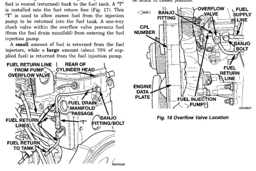

USE EXTREME CAUTION WARNING: WHEN INSPECTING FOR HIGH-PRESSURE FUEL LEAKS. INSPECT FOR HIGH-PRESSURE FUEL LEAKS WITH A SHEET OF CARDBOARD. HIGH FUEL INJECTION PRESSURE CAN CAUSE PERSONAL INJURY IF CONTACT IS MADE WITH THE SKIN.

When the engine is running, and during injection, a small amount of fuel flows past the injector nozzle and is not injected into the combustion chamber. This fuel is used to lubricate the fuel injectors. Excess fuel drains into the fuel drain manifold (or passage). The fuel drain manifold is actually a rifled passage within the cylinder head (Fig. 17). Fuel is drained from this passage into a line at the rear of the cylinder head (Fig. 17). After exiting the cvlinder head. fuel is routed (returned) back to the fuel tank. A "T" is installed into the fuel return line (Fig. 17). This "T" is used to allow excess fuel from the injection pump to be returned into the fuel tank. A one-way check valve within the overflow valve prevents fuel (from the fuel drain manifold) from entering the fuel injection pump. A small amount of fuel is returned from the fuel injectors, while a large amount (about 70% of supplied fuel) is returned from the fuel injection pump.

*Fig. 17 Fuel Drain Manifold Passage*

Fuel volume from the fuel transfer (lift) pump will always provide more fuel than the fuel injection pump requires. The overflow valve (a pressure relief valve) is used to route excess fuel through the fuel return line and back to the fuel tank. Approximately 70% of supplied fuel is returned to the fuel tank. The valve is located on the side of the injection pump (Fig. 18). It is also used to connect the fuel return line (banjo fitting) to the fuel injection pump. The valve opens at approximately 97 kPa (14 psi). If the check valve within the assembly is sticking, low engine power, hard starting or white smoke may result. If a Diagnostic Trouble Code (DTC) has been stored for "decreased engine performance due to high injection pump fuel temperature", the overflow valve may be stuck in closed position.

*Fig. 18 Overflow Valve Location*

*Fig. 17*
