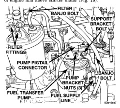
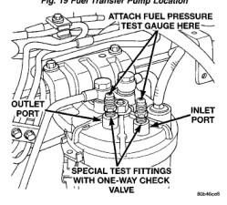

*Fig. 20*

Air will enter the fuel system whenever fuel supply lines, separator filters, iniection pump, high-pressure lines or iniectors are removed or disconnected. Air trapped in the fuel system can result in hard starting, a rough running engine, engine misfire, low power, excessive smoke and fuel knock. After service is performed, air must be blod from the system before starting the engine. Inspect the fuel system from the fuel transfer pump to the injectors for loose connections. Leaking fuel is an indicator of loose connections or defective seals. Air can also enter the fuel system between the fuel tank and the transfer pump. Inspect the fuel tank and fuel lines for damage that might allow air into the system. For air bleeding, refer to the Air Bleed Procedure.

Fuel supply line restrictions or a defective fuel transfer pump can cause starting problems and prevent engine from revving up. The starting problems include; low power and/or white fog like exhaust. Test all fuel supply lines for restrictions or blockage. Flush or replace as necessary. Bleed fuel system of air once a fuel supply line has been replaced. Refer to Air Bleed Procedure for procedures. To test for fuel line restrictions, a vacuum restriction test may be performed. Refer to Fuel Transfer Pump Pressure Test.

Restricted (kinked or bent) high-pressure lines can cause starting problems, poor engine performance. engine mis-fire and white smoke from exhaust. Examine all high-pressure lines for any damage. Each radius on each high-pressure line must be smooth and free of any bends or kinks. Replace damaged, restricted or leaking high-pressure fuel lines with correct replacement line.

CAUTION: All high-pressure fuel lines must be clamped securely in place in holders. Lines cannot contact each other or other components. Do not attempt to weld high-pressure fuel lines or to repair lines that are damaged. If line is kinked or bent, it must be replaced. Use only recommended lines when replacement of high-pressure fuel line is necessary.

The following tests will include: pressures tests of fuel transfer pump (engine running and engine cranking), a pressure drop test of fuel filter, a test for supply side restrictions, and a test for air in fuel supply side. Refer to Fuel Transfer Pump Description/Operation for an operational description of transfer pump. The fuel transfer (lift) pump is located on left side of engine and above starter motor (Fig. 19).

*Fig. 21*

Fig. 19 Fuel Transfer Pump Location

[Figure]

*Fig. 20 Fuel Pressure Test Port Fitting Location*
