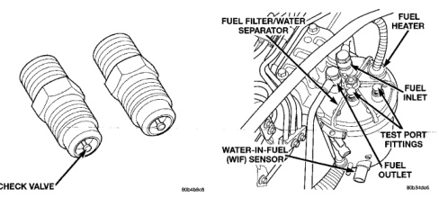
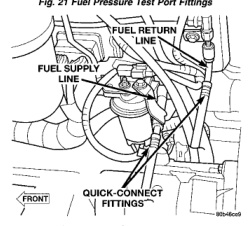

*Fig. 21*

*CHECK VALVE*

*Fig. 21 Fuel Pressure Test Port Fittings*

*Fig. 22 Fuel Return and Supply Line Quick-Connect Locations*

An improperly operating fuel transfer pump, a plugged or dirty fuel filter, or a defective overflow valve can cause low engine power, excessive white smoke and/or hard engine starting. Before performing following tests, inspect fuel supply and return lines for restrictions, kinks or leaks. Fuel leaking from pump casing indicates a leaking pump which must be replaced. Pressure Test: Because the transfer pump is operating at two different pressure cycles (engine running and engine cranking), two different pressure tests will be performed. (1) Remove 2 existing filter fittings (plugs) at top of fuel filter housing (Fig. 19) (clean area around fittings before fitting removal). In place of 2 fittings

(plugs), install 2 special fittings (Fig. 20). These special fittings are equipped with a spring-loaded shutoff valve (one-way check valve) and are commercially available from a Tube Fitting Supplier. Use Parker® Access Valve. Male Connector part number AVU1-2 or equivalent (Fig. 21). (2) Install Special Fuel Pressure Test Gauge 6828 (or equivalent) to special fitting at INLET PORT (Fig. 20). (3) To prevent engine from starting, remove fuel system relay (fuel injection pump relay). Relay is located in Power Distribution Center (PDC). Refer to label under PDC cover for relay location. (4) Using kev, crank engine over while observing gauge. Pressure should be 5-7 psi. (5) Re-install fuel system relay to PDC. (6) Start engine and record fuel pressure. Pressure should be a minimum of 69 kPa (10 psi) at idle speed. (7) Because fuel pump relay was removed, a Diagnostic Trouble Code (DTC) may have been set. After testing, use DRB scan tool to remove DTC. Pressure Drop Test: (8) Shut engine off and remove test gauge from INLET PORT. Re-attach 6828 test gauge to OUTLET PORT (Fig. 20). Start engine and record fuel pressure. Pressure should not be more than 34 kPa (5 psi) lower than INLET PORT pressure test. If so, replace fuel filter. Fuel Supply Restriction Test: Due to very small vacuum specifications, the DRB scan tool along with the Periphal Expansion Port (PEP) Module and 0-15 psi transducer must be used. (9) Verify transfer pump pressure is OK before performing restriction test.
