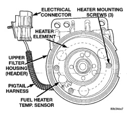
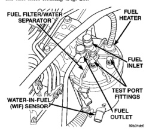

(6) Internal check valve should release, and air should pass through valve at 97 kPa (14-16 psi). If not, replace valve. (7) Reduce regulated air pressure to 10 psi and observe valve. Valve should stay shut. If not, replace valve. (8) Install new sealing gaskets to valve. (9) Install valve through banjo fitting and into pump. (10) Tighten to 30 N-m (24 ft. Ibs.) torque.

The fuel heater is used to prevent diesel fuel from waxing during cold weather operation.

NOTE: The fuel heater element, fuel heater relay and fuel heater temperature sensor are not controlled by the powertrain control module (PCM).

A malfunctioning fuel heater can cause a wax build-up in the fuel filter/water separator. Wax build-up in the filter/separator can cause engine starting problems and prevent the engine from revving up. It can also cause blue or white fog-like exhaust. If the heater is not operating in cold temperatures, the engine may not operate due to fuel waxing. The fuel heater assembly is located in the top of the fuel filter housing (Fig. 25).

*Fig. 25*

The heater assembly is equipped with a built-in fuel temperature sensor (thermostat) (Fig. 26) that senses fuel temperature. When fuel temperature drops below 45 degrees ± 8 degrees F, the sensor allows current to flow to the built-in heater element to warm the fuel. When fuel temperature rises above

*Fig. 26*

75 degrees ± 8 degrees F, the sensor stops current flow to the heater element (circuit is open). Voltage to operate the fuel heater element is supplied from the ignition switch, through the fuel heater relay (also refer to Fuel Heater Relay), to the fuel temperature sensor and on to the fuel heater element. The heater element operates on 12 volts, 300 watts at 0 degrees F. As temperature increases, power requirements decrease. A minimum of 7 volts is required to operate the fuel heater. The resistance value of the heater element is less than 1 ohm (cold) and up to 1000 ohms warm.

(1) Disconnect heater pigtail harness (Fig. 26) from main engine harness. Connection is made above and slightly rearward of fuel filter. All heater testing will be done at these 2 connectors. Turn key to ON position. 12 volts should be present at red wire (at engine harness side of connector). If not, check fuel heater relay and related wiring. Refer to Relay Test-Fuel Heater. If OK, proceed. Turn key OFF. Check black wire (at engine harness side of connector) for ground continuity with an ohmmeter. If continuity is not present, correct ground circuit. If OK, proceed. (2) With pigtail harness connector still unplugged and kev OFF. check electrical/mechanical operation of fuel temperature sensor (Fig. 26). Proceed to next step: (3) Using an ohmmeter, check resistance across two terminals in connector (at heater side of connector). Sensor circuit should be open if fuel tempera-
