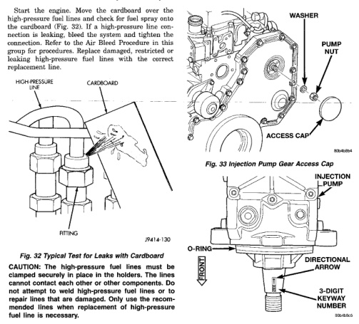

*Fig. 33*

With the Bosch VP44 injection pump, there are no mechanical adjustments needed for fuel injection timing. All timing and fuel adjustments are made by the Engine Control Module (ECM). However, if a Diagnostic Trouble Code (DTC) has been stored indicating an "engine sync error" or a "static timing error", perform the following. Note: If this DTC appears after installation of a new or rebuilt injection pump, the pump keyway has probably been installed backwards. Refer to Fuel Injection Pump Removal/Installation for keyway information. (1) Remove plastic access cover, injection pump nut and washer (Fig. 33). Locate keyway behind washer.

*Fig. 33 Injection Pump Gear Access Cap*

*Number*

(2) Be sure keyway aligning fuel injection pump shaft to iniection pump gear is in proper position and pump gear has not slipped on pump shaft. The following steps will require removing timing gear cover to gain access to timing gears. Refer to Group 9. Engines for procedures. (3) Use a T-tvpe puller to separate injection pump gear from pump shaft. (4) Be sure keyway has been installed with arrow pointed to rear of pump (Fig. 34). (5) Pump timing has been calibrated to pump keyway. Be sure 3-digit number on pump keyway (Fig. 34) matches 3-digit number on fuel injection pump data plate. Plate is located on
