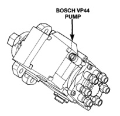

## FUEL SYSTEM 14-7

### DESCRIPTION AND OPERATION (Continued)

#### FUEL INJECTION PUMP

The Bosch VP44 fuel injection pump (Fig. 10) is a solenoid-valve controlled-radial-piston-distributor type pump. The pump is mounted to the rear of the timing gear housing on the left side of engine (Fig. 11).

The injection pump is driven by the engine camshaft. A gear on the end of the pump shaft meshes with the camshaft gear. The pump is timed to the engine. The VP44 is controlled by an integral (and non-serviceable) Fuel Pump Control Module (FPCM) (Fig. 11). The FPCM can operate the engine as an engine controller if a Crankshaft Position Sensor (CKP) signal is not present.

Fuel from the transfer (lift) pump enters the VP44 where it is pressurized and then distributed through high-pressure lines to the fuel injectors. The VP44 is cooled by the fuel that flows through it. A greater quantity of fuel is required for cooling the VP44 than what is necessary for engine operation. Because of this, approximately 70 percent of fuel entering the pump is returned to the fuel tank through the overflow valve and fuel return line. Refer to Overflow Valve Description/Operation for additional information.

The VP44 is not self-priming. At least two fuel injectors must be bled to remove air from the system. When servicing the fuel system, disconnecting components up to the pump will usually not require air bleeding from the fuel system. However, removal of the high-pressure lines, removal of the VP44 pump, or allowing the vehicle to completely run out of fuel, will require bleeding air from the high-pressure lines at the fuel injectors.

VP44 timing is matched to engine timing by an offset keyway that fits into the pump shaft. This keyway has a stamped number on it that is matched to a number on the VP44 pump (each keyway is calibrated to each pump).

When removing/installing the VP44, the same numbered keyway must always be installed. Also, the arrow on the top of the keyway should be installed pointed to the rear of pump.

Because of electrical control, the injection pump high and low idle speeds are not adjustable. Also, adjustment of fuel pump timing is not required and is not necessary.

*Fig. 10 Bosch VP44 Fuel Injection Pump]*

*Fig. 11 Fuel Injection Pump Location*