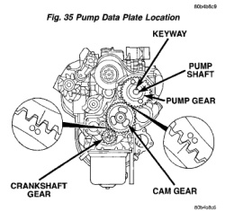
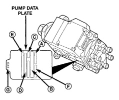

*Fig. 35*

A. ORDER NUMBER B. BOSCH PART NUMBER C. FACTORY CODE D. CUMMINS PART NUMBER E. MANUFACTURE DATE F. PUMP SERIAL NUMBER G. LAST THREE DIGITS OF KEY PART NUMBER

*Fig. 36*

Fig. 36 Checking Fuel Injection Pump Gear Timing

side of injection pump (Fig. 35). Twentv-one different calibrated keyways/pumps are available. (6) Verify timing marks on crank, cam and pump are aligned (Fig. 36). (7) Perform necessary gear alignment/repairs as needed. (8) After repairs are completed, erase DTC using DRB Scan Tool.

CAUTION: Cleanliness cannot be overemphasized when handling or replacing diesel fuel system components. This especially includes the fuel injectors, high-pressure fuel lines and fuel injection pump. Very tight tolerances are used with these parts. Dirt contamination could cause rapid part wear and possible plugging of fuel injector nozzle tip holes. This in turn could lead to possible engine misfire. Always wash/clean any fuel system component thoroughly before disassembly and then air dry. Cap or cover any open part after disassembly. Before assembly, examine each part for dirt, grease or other contaminants and clean if necessary. When installing new parts. lubricate them with clean engine oil or clean diesel fuel only.

A certain amount of air becomes trapped in the fuel system when fuel system components on the supply and/or high-pressure side are serviced or replaced. Primary air bleeding is accomplished using the electric fuel transfer (lift) pump. If the vehicle has been allowed to run completely out of fuel, the fuel injectors must also be bled as the fucl injection pump is not self-bleeding (priming). Servicing or replacing components on the fuel return side will not require air bleeding.

(1) Loosen, but do not remove, banjo bolt holding low-pressure fuel supply line to side of fuel injection pump (Fig. 37). Place a shop towel around banjo fitting to catch excess fuel. The fuel transfer (lift) pump is self-priming: When the key is first turned on (without cranking engine), the pump operates for approximately 2 seconds and then shuts off. The pump will also operate for up to 25 seconds after the starter is engaged, and then disengaged and the engine is not running. The pump shuts off immediately if the key is on and the engine stops running. (2) Turn key to CRANK position and quickly release key to ON position before engine starts. This will operate fuel transfer pump for approximately 25 seconds. (3) If fuel is not present at fuel supply line after 25 seconds, turn key OFF. Repeat previous step until fuel is exiting at fuel supply line.
