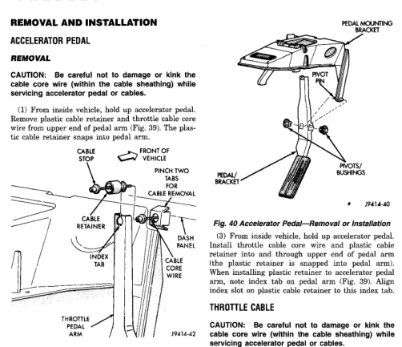

*Fig. 40*

[Figure]

(2) Insert a small screwdriver into square holes located on pivots/bushings (Fig. 40). Twist screwdriver to disengage pivot locks from pivot pin. Pivots will be damaged when removing. Discard old pivots. (3) Remove pedal/bracket assembly from vehicle.

(1) Position pedal/bracket assembly over pivot pin (Fig. 40). (2) Install two new pivots/bushings. Using large pliers, press both bushings together until they bottom on sides of pedal/bracket assembly. Bushing retaining ears will snap into position when properly installed.

Be careful not to damage or kink the CAUTION: cable core wire (within the cable sheathing) while servicing accelerator pedal or cables.

(1) Disconnect both negative battery cables at both batteries. (2) From inside vehicle, hold up accelerator pedal. Remove plastic cable retainer and throttle cable core wire from upper end of pedal arm (Fig. 39). The plastic cable retainer snaps into pedal arm. (3) Remove cable core wire at pedal arm. (4) From inside vehicle, pinch both sides of plastic cable housing retainer tabs at dash panel (Fig. 39). (5) Remove cable housing from dash panel and pull cable into engine compartment.
