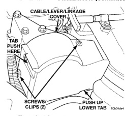
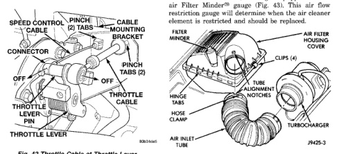

*Fig. 41*

(6) Remove cable cover (Fig. 41). Cable cover is attached with 2 Phillips screws, 2 plastic retention clips and 2 push tabs (Fig. 41). Remove 2 Phillips screws and carefully pry out 2 retention clips. After clip removal, push rearward on front tab, and upward on lower tab for cover removal. (7) Using 2 screwdrivers, pry cable connector socket from throttle lever ball (Fig. 42). Be very careful not to bend throttle lever arm.

(8) Squeeze 2 pinch tabs on sides of throttle cable at mounting bracket (Fig. 42) and push cable rearward out of bracket .

(1) Install cable through mounting hole on cable mounting bracket (Fig. 42). Cable snaps into bracket. Be sure 2 pinch tabs are secure. (2) Using large pliers, connect cable end socket to throttle lever ball (snaps on). (3) Install remaining cable housing end into and through dash panel opening (snaps into position). The two plastic pinch tabs (Fig. 39) should lock cable to dash panel. (4) From inside vehicle, hold up accelerator pedal. Install throttle cable core wire and plastic cable retainer into and through upper end of pedal arm (the plastic retainer is snapped into pedal arm). When installing plastic retainer to accelerator pedal arm, note index tab on pedal arm (Fig. 39). Align index slot on plastic cable retainer to this index tab. (5) Connect negative battery cables to both batteries. (6) Before starting engine, operate accelerator pedal to check for any binding. (7) Install cable/lever cover.

Do not attempt to unnecessarily remove the top of the air cleaner housing for air cleaner element inspection on diesel engines. The air cleaner (filter) housing is equipped with an air Filter Minder48 gauge (Fig. 43). This air flow restriction gauge will determine when the air cleaner element is restricted and should be replaced.

*Fig. 43 Filter Minder -- Location-Diesel Engine*

*Fig. 42*
