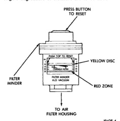

The Filter Minderds consists of a diaphragm and calibrated spring sealed inside of a plastic housing (Fig. 44). A yellow colored disc attached to the diaphragm moves along a graduated scale on the side of the Filter Minder. After the engine has been shut off. a ratcheting device located within the Filter Minder will hold the yellow disc at the highest restriction that the air cleaner element has experienced. A drop in air pressure due to an air cleaner element restriction moves the diaphragm and the yellow disc will indicate the size of the air drop.

CAUTION: Certain engine degreasers or cleaners may discolor or damage the plastic housing of the Filter Minder. Cover and tape the Filter Minder if any engine degreasers or cleaners are to be used.

*Fig. 44*

J9425-4

To test, turn the engine off. If the yellow disc (Fig. 44) has reached the red colored zone on the graduated scale, the air cleaner element should be replaced. Refer to the proceeding removal/installation paragraphs. Resetting the Filter Minder: After the air cleaner (filter) element has been replaced, press the rubber button on the top of the Filter Minder (Fig. 44). This will allow the yellow colored disc to reset. After the button has been pressed, the yellow disc should spring back to the UP position. If the Filter Minder gauge has reached the red colored zone, and after an examination of the air cleaner (filter) element, the element appears to be clean, the high reading may be due to a temporary condition such as snow build-up at the air intake. Temporary high restrictions may also occur if the air

cleaner (filter) element has gotten wet such as during a heavy rain or snow. If this occurs, allow the element to dry out during normal engine operation. Reset the rubber button on the top of the Filter Minder and retest after the element has dried.

(1) Loosen air inlet tube clamp at air cleaner housing inlet (Fig. 43). Remove this tube at air cleaner housing cover. (2) The housing cover is equipped with four (4) spring clips (Fig. 43) and is hinged at front with plastic tabs. Unlatch clips from top of air cleaner housing and tilt housing cover up and forward for cover removal. (3) Remove air cleaner element from air cleaner housing.

(1) Before installing a new air cleaner element, clean inside of air cleaner housing. (2) Position air cleaner cover to tabs on front of air cleaner housing. Latch four spring clips to seal cover to housing. (3) Install air inlet tube at air cleaner housing inlet. Note hose alignment notches at both inlet hose and air cleaner cover (Fig. 43). (4) Position tube clamp to inlet tube and tighten to 3 N.m (25 in. Ibs.) torque.

The fuel drain manifold (line) connects a fuel return passage within the cylinder head to a "T" fitting on the fuel return line. It is located at the rear of the cylinder head.

(1) Disconnect both negative battery cables at both batteries. (2) Remove starter motor. Refer to Group 8B for procedures. (3) Disconnect fitting at "T" (Fig. 45). (4) Remove banjo bolt at rear of cylinder head. Discard old sealing washers. (5) Remove fuel line from vehicle. (6) Clean connection at rear of cylinder head before line installation.

Servicing fuel return components will not require air bleeding. (1) Using new sealing washers, assemble banjo bolt to fuel line. (2) Position line to engine and loosely tighten fasteners. (3) Tighten banjo bolt to 24 N-m (18 ft. Ibs.) torque.
