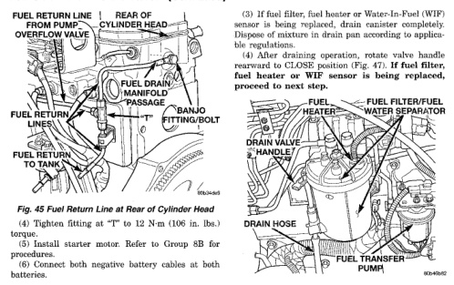
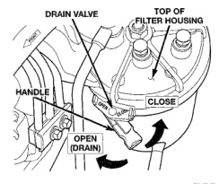

*Fig. 46*

Refer to maintenance schedules in Group 0 in this manual for recommended fuel filter replacement intervals. The fuel filter/water separator assembly is located on left/rear side of engine above starter motor (Fig. 46). The assembly contains the fuel filter cartridge, Water-In-Fuel (WIF) sensor, and fuel heater.

The canister drain valve (Fig. 47) serves two purposes. One is to partially drain filter canister of excess water. The other is to completely drain canister for filter, heater or water-in-fuel sensor replacement. The filter should be drained whenever water-infuel warning lamp remains illuminated. (Note that lamp will be illuminated for approximately two seconds when ignition key is initially placed in ON position for a bulb check). (1) A drain hose is located at bottom of drain valve (Fig. 48). Place drain pan under drain hose. (2) With engine not running, rotate drain valve handle forward to OPEN (DRAIN) position (Fig. 47). Hold drain valve open until all water and contaminants have been removed and clean fuel exits drain hose.

*Fig. 46 Fuel Filter/Water Separator/Drain Hose Location*

*Fig. 47*

*806-462-63*

(5) Remove drain hose at drain valve (Fig. 46). (6) Disconnect Water-In-Fuel (WIF) sensor electrical connector at sensor. The WIF sensor is located at side of filter canister (Fig. 48).
