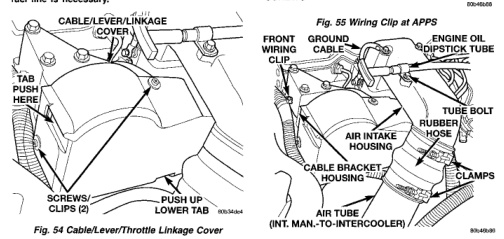
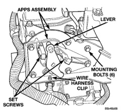

High-pressure lines are used between the fuel injection pump and the fuel injectors only. All highpressure fuel lines are of the same length and inside diameter. Correct high-pressure fuel line usage and installation is critical to smooth engine operation. Whenever the high-pressure lines are removed, they should be removed as a bundle (if possible). They should also be tagged for return to original position.

CAUTION: The high-pressure fuel lines must be clamped securely in place in the holders. The lines cannot contact each other or other components. Do not attempt to weld high-pressure fuel lines or to repair lines that are damaged. Only use the recommended lines when replacement of high-pressure fuel line is necessary.

*Fig. 54 Cable/Lever/Throttle Linkage Cover*

(1) Disconnect both negative battery cables from both batteries. Cover and isolate ends of cables. (2) Thoroughly clean fuel lines at cylinder head and injection pump ends. (3) Remove cable cover (Fig. 54). Cable cover is attached with 2 Phillips screws, 2 plastic retention clips and 2 push tabs (Fig. 54). Remove 2 Phillips screws and carefully pry out 2 retention clips. After clip removal, push rearward on front tab, and upward on lower tab for cover removal. Do not remove any cables at lever. (4) Disconnect wiring harness (clip) at bottom of Accelerator Pedal Position Sensor (APPS) mounting bracket (Fig. 55).

*Fig. 55 Wiring Clip at APPS*

(5) Using 2 small screwdrivers, pry front wiring clip (Fig. 56) from cable bracket housing. Position wiring harness towards front of engine. (6) Remove electrical connector from APPS by pushing connector tab rearward while pulling down on connector (Fig. 57). (7) Disconnect 2 electrical cables from cable mounting studs (Fig. 58) at intake air heater on top of intake manifold. (8) Remove engine oil dipstick from engine. (9) Remove engine oil dipstick tube support mounting bolt (Fig. 56) and position tube to side. (10) Disconnect clamps and remove air tube (intake manifold-to-intercooler) (Fig. 56).

*Fig. 54*
