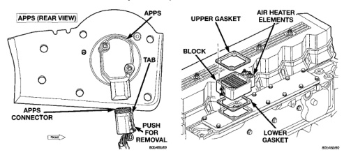
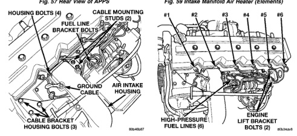

*Fig. 57 Rear View of APPS*

(11) Remove 4 air intake housing mounting bolts and remove housing (Fig. 58). Position ground cable at top of air intake housing to front of engine. (12) Remove intake manifold air heater element block from engine (Fig. 59). Discard old upper and lower gaskets (13) Remove 3 cable bracket housing mounting bolts (Fig. 58). Carefully position cable bracket and cable assembly to side of engine. Leave cables connected to lever. (14) Remove engine lifting bracket at rear of intake manifold (2 bolts) (Fig. 60). (15) Remove bolts from all fuel injection line support brackets at intake manifold (Fig. 58).

Fig. 59 Intake Manifold Air Heater (Elements)

(16) Place shop towels around fuel lines at fuel injectors. Do not allow fuel to drip down side of engine.

CAUTION: WHEN LOOSENING OR TIGHTENING HIGH-PRESSURE FITTINGS AT INJECTION PUMP. USE A BACK-UP WRENCH ON DELIVERY VALVE AT PUMP. DO NOT ALLOW DELIVERY VALVE TO ROTATE.

(17) Loosen high-pressure lines at injection pump (Fig. 61) beginning with cylinders 1, 2 and 4. (18) Loosen high-pressure lines at cylinder head for cylinders 1, 2 and 4 (Fig. 60).

*Fig. 58*
