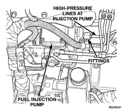

*Fig. 60*

(19) Carefully remove front line bundle from engine. Do not bend lines while removing. While removing front line bundle, note line position. (20) Loosen high-pressure lines at injection pump beginning with cylinders 3. 5 and 6. (21) Loosen high-pressure lines at cylinder head for cylinders 3, 5 and 6 (Fig. 60), (22) Carefully remove rear line bundle from engine. Do not bend lines while removing. While removing rear line bundle, note line position.

CAUTION: Be sure that the high-pressure fuel lines are installed in the same order that they were removed.

(1) Lubricate threads of injector line fittings with clean engine oil (2) Loosen, but do not remove, all fuel line support bracket bolts. (3) Install rear injection line bundle beginning with cylinder head (fuel iniector) connections, followed by injection pump connections. Tighten all fittings finger tight. (4) Tighten fittings at fuel injector ends for cvlinders number 6 and 5 to 40 N-m (30 ft. lbs.) torque. Do not tighten number 3 line at this time. It will be tightened during bleeding procedure. (5) Tighten 3 fittings at fuel iniection nump ends to 24 N.m (18 ft. lbs.) torque. (6) Install front injection line bundle beginning with cylinder head (fuel injector) connections, followed by iniection pump connections. Tighten all fittings finger tight.

(7) Tighten fitting at fuel injector end for cylinder number 2 to 40 N-m (30 ft. lbs.) torque. Do not tighten lines number 1 or 4 at this time. They will be tightened during bleeding procedure. (8) Tighten remaining 3 fittings at fuel injection pump ends to 24 N-m (18 ft. lbs.) torque. (9) Install fuel line support bracket bolts to intake manifold and tighten to 24 N-m (18 ft. lbs.) torque.

CAUTION: Be sure fuel lines are not contacting each other or any other component. Noise will result.

(10) Install engine lifting bracket at rear of intake manifold. Tighten 2 bolts to 77 N.m (57 ft. Ibs.) torque. (11) Install cable bracket housing/cable assembly and tighten 3 mounting bolts to 24 N-m (18 ft. Ibs.) torque. (12) Clean any old gasket material below and above intake manifold air heater element block. Also clean mating areas at intake manifold and air intake housing. (13) Using new gaskets, position intake manifold air heater element block to engine. (14) Install air intake housing and position ground cable. Install 4 mounting bolts (Fig. 58) and tighten to 24 N.m (18 ft. lbs.) torque. (15) Install air tube (intake manifold-to-intercooler) (Fig. 56). Tighten clamps to 8 N.m (72 in. Ibs.) torque. (16) Install engine oil dipstick tube support mounting bolt (Fig. 56) and tighten to 24 N.m (18 ft. lbs.) torque. (17) Install engine oil dipstick to engine. (18) Connect 2 electrical cables to cable mounting studs (Fig. 58). (19) Connect electrical connector to bottom of APPS by pushing connector upward until it snaps into position. (20) Connect wiring harness (clip) at bottom of Accelerator Pedal Position Sensor (APPS) mounting bracket (Fig. 55). (21) Connect front wiring clip (Fig. 56) to cable bracket housing. (22) Install cable cover (Fig. 54). (23) Connect both negative battery cables to both batteries. (24) Bleed air from fuel system. Do this at fuel injector ends of lines. Use cylinders numbers 1, 3 and 4 for bleeding . Refer to Air Bleed Procedure section of this group. After bleeding, tighten fittings to 40 N.m (30 ft. lbs.) torque. (25) Check lines/fittings for leaks.
