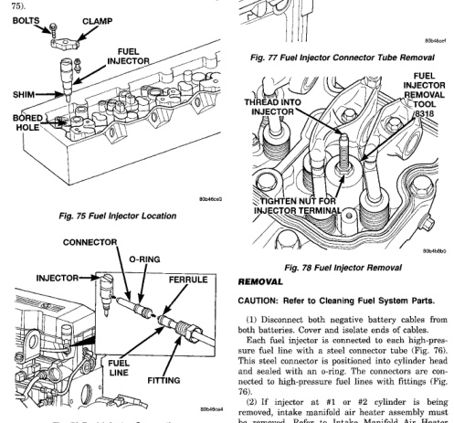

bracket. Refer to High-Pressure Fuel Line Removal/ Installation. All of these items are covered in this procedure. (14) Connect 9-way electrical connector to Fuel Punp Control Module (FPCM) (Fig. 63). (15) Connect both negative battery cables to both batteries. (16) Bleed air from fuel system. Refer to Air Bleed Procedure. (17) Check system for fuel or engine oil leaks.

The fuel injectors are located in the top of the cylinder head between the intake/exhaust valves (Fig.

*Fig. 75 Fuel Injector Location*

*Fig. 76 Fuel Injector Connections*

*Fig. 75*

(1) Disconnect both negative battery cables from both batteries. Cover and isolate ends of cables. Each fuel injector is connected to each high-pressure fuel line with a steel connector tube (Fig. 76). This steel connector is positioned into cylinder head and sealed with an o-ring. The connectors are connected to high-pressure fuel lines with fittings (Fig. 76). (2) If injector at #1 or #2 cylinder is being removed, intake manifold air heater assembly must be removed. Refer to Intake Manifold Air Heater Removal/Installation.

[Figure]
