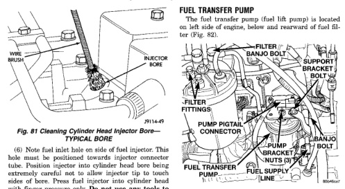

*Fig. 81 Cleaning Cylinder Head Injector Bore TYPICAL BORE*

(6) Note fuel inlet hole on side of fuel injector. This hole must be positioned towards injector connector tube. Position injector into cylinder head bore being extremely careful not to allow injector tip to touch sides of bore. Press fuel injector into cylinder head with finger pressure only. Do not use any tools to press fuel injector into position. Damage to machined surfaces may result. (7) Position fuel injector hold down clamp into shouldered bolt while aligning slot in top of injector into groove in bottom of clamp. Tighten opposite clamp bolt (Fig. 75) to 10 N.m (89 in. lbs.) torque. (8) Install new o-ring to fuel injector connector tube. Apply small amount of clean engine oil to o-ring. (9) Press injector connector tube into cylinder head with finger pressure only. Do not use any tools to press tube into position. Damage to machined surfaces may result. (10) Connect high-pressure fuel lines. Refer to High-Pressure Fuel Lines Removal/Installation. The fuel line fitting torque is very critical. If fitting is under torqued, the mating surfaces will not seal and a high-pressure fuel leak will result. If fitting is over torqued, the connector and iniector will deform and also cause a high-pressure fuel leak. This leak will be inside cvlinder head and will not be visible resulting in a possible fuel injector miss and low power. (11) Install valve cover. Refer to Group 9, Engines. (12) (If necessary) install intake manifold air heater assembly. Refer to Intake Manifold Air Heater Removal/Installation. (13) (If necessary) install engine lifting bracket. Tighten 2 bolts to 77 N-m (57 ft. lbs.) torque. (14) Connect negative battery cables to both batteries. (15) Bleed air from high-pressure lines. Refer to Air Bleed Procedure.

(1) Disconnect both negative battery cables at both batteries. (2) Thoroughly clean area around transfer pump and fuel lines of anv contamination. (3) Remove starter motor. Refer to Starter in Group 8B for procedures. (4) Place a drain pan below the pump. (5) Disconnect fuel line quick-connect fitting at fuel supply line (Fig. 82) at rear of pump. (6) Remove support bracket bolt at top of pump (Fig. 82). (7) Remove banjo bolts at front and rear of pump (Fig. 82). (8) Disconnect pigtail harness electrical connector from main engine wiring harness (Fig. 82). (9) Remove three pump bracket nuts (Fig. 82) and remove pump from vehicle.

(1) Install new gaskets to fuel supplv line/support bracket and banjo bolt at rear of pump. Install line and banjo bolt to pump. Do not tighten banjo bolt at this time. (2) Install new gaskets to fuel line and banio bolt at front of pump. (3) Position 3 pump studs into pump mounting bracket and install 3 nuts. Do not tighten nuts at this time. (4) Install support bracket bolt (Fig. 82). Do not tighten bolt at this time.
