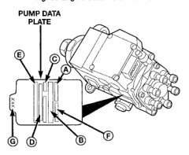
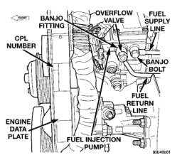

(5) Tighten 3 pump nuts to 12 N.m (9 ft. Ibs.) torque. (6) Tighten both banjo bolts to 24 N.m (18 ft. lbs.) torque. (7) Tighten support bracket bolt 12 N-m (9 ft. lbs.) torque. (8) Connect pigtail harness electrical connector to main engine wiring harness (Fig. 82). (9) Connect fuel line quick-connect fitting to fuel supply line at rear of pump. (10) Install starter motor. Refer to Starter Removal/Installation in Group 8B for procedures. (11) Connect both negative battery cables at both batteries. (12) Bleed air at fuel supply line at side of fuel injection pump. Refer to the Air Bleed Procedure. (13) Start engine and check for leaks.

The engine data plate contains:

• · Advertised horsepower · Cubic inch/liter of engine · Engine model number · Fuel rate at advertised horsepower · Idle speed specification · Injection pump CPL number · Injection pump timing (in degrees) · Injector firing order · Valve lash specification

If anything differs between the specifications found on the engine data plate, and the specifications used in this manual, use specifications on data plate. The engine data plate is permanently riveted to the side of the engine timing gear cover located on the drivers side of engine (Fig. 83).

Pertinent information about the fuel injection pump is machined into a boss on the drivers side of the fuel injection pump (Fig. 84).

MODEL LITERS U.S. GALLONS 138" Wheelbase With Extended Cab 129 34 (Diesel Powered) All Other Diesel 132 35 Powered Models

Nominal refill capacities are shown. A variation may be observed from vehicle to vehicle due to manufacturing tolerance and refill procedure.

*Fig. 83 Engine Data Plate Location*

*Fig. 82*

A. ORDER NUMBER B. BOSCH PART NUMBER C. FACTORY CODE D. CUMMINS PART NUMBER E. MANUFACTURE DATE F. PUMP SERIAL NUMBER G. LAST THREE DIGITS OF KEY PART NUMBER

80645800

Fig. 84 Fuel Injection Pump Data Plate Location
