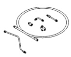
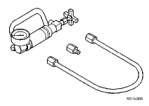
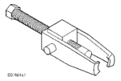
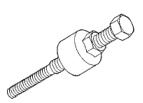

# SPECIFICATIONS

## TORQUE CHART

| DESCRIPTION | TORQUE |
|-------------|--------|
| **Power Steering Pump** | |
| Reservoir Bolts | 56 N·m (42 ft. lbs.) |
| Flow Control Valve | 75 N·m (55 ft. lbs.) |
| Pressure Line | 31 N·m (23 ft. lbs.) |
| Oil Cooler Bolt | 20 N·m (15 ft. lbs.) |
| **Pump Mounting - 3.9L, 5.2L & 5.9L** | |
| Bracket to Pump | 47 N·m (35 ft. lbs.) |
| Bracket to Engine | 41 N·m (30 ft. lbs.) |
| **Pump Mounting - 8.0L** | |
| Rear Bracket to Pump | 47 N·m (35 ft. lbs.) |
| Rear Bracket to Front Bracket | 24 N·m (18 ft. lbs.) |
| Bracket to Engine | 41 N·m (30 ft. lbs.) |
| **Pump Mounting - Diesel** | |
| Pump to Vacuum Pump | 24 N·m (18 ft. lbs.) |
| Pump Assembly to Engine | 77 N·m (57 ft. lbs.) |
| Pump to Support Bracket | 24 N·m (18 ft. lbs.) |

## SPECIAL TOOLS

### POWER STEERING PUMP

*Fig. 1 Analyzer Set, Power Steering Flow/Pressure 6815*

*Fig. 2 Adapters, Power Steering Flow/Pressure Tester 6893*

*Fig. 3 Puller C-4333*

*Fig. 4 Installer, Power Steering Pulley C-4063-B*

*Source: 19 Steering, Page 10*
