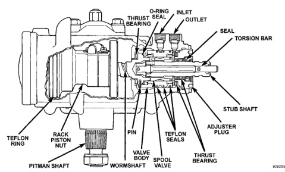

# POWER STEERING GEAR

## INDEX

| DESCRIPTION AND OPERATION | page | | page |
|---|---|---|---|
| POWER STEERING GEAR | 11 | RACK PISTON AND WORM SHAFT | 16 |
| **DIAGNOSIS AND TESTING** | | SPOOL VALVE | 14 |
| POWER STEERING GEAR LEAKAGE | | **ADJUSTMENTS** | |
| DIAGNOSIS | 12 | STEERING GEAR | 18 |
| **REMOVAL AND INSTALLATION** | | **SPECIFICATIONS** | |
| POWER STEERING GEAR | 12 | POWER STEERING GEAR | 20 |
| **DISASSEMBLY AND ASSEMBLY** | | TORQUE CHART | 20 |
| HOUSING END PLUG | 12 | **SPECIAL TOOLS** | |
| PITMAN SHAFT/SEALS/BEARING | 13 | POWER STEERING GEAR | 21 |

## DESCRIPTION AND OPERATION

### POWER STEERING GEAR

The power steering gear is a recirculating ball type gear (Fig. 1). The gear acts as a rolling thread between the worm shaft and rack piston. The worm shaft is supported by a thrust bearing at the lower end and a bearing assembly at the upper end. When the worm shaft is turned the rack piston moves. The rack piston teeth mesh with the pitman shaft. Turning the worm shaft turns the pitman shaft, which turns the steering linkage.

*Fig. 1 Power Steering Gear]*

*Fig. 1 Power Steering Gear*

*Source: 19 Steering, Page 11*
