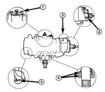
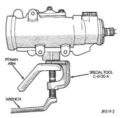
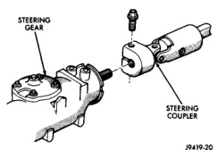

# DIAGNOSIS AND TESTING

## POWER STEERING GEAR LEAKAGE DIAGNOSIS

*Fig. 2 Power Steering Gear Leakage Diagnosis]*

1. **SIDE COVER LEAK** - TORQUE SIDE COVER BOLTS TO SPECIFICATION. REPLACE THE SIDE COVER SEAL IF THE LEAKAGE PERSISTS.

2. **ADJUSTER PLUG SEAL** - REPLACE THE ADJUSTER PLUG SEALS.

3. **PRESSURE LINE FITTING** - TORQUE THE HOSE FITTING NUT TO SPECIFICATIONS. IF LEAKAGE PERSISTS, REPLACE THE SEAL.

4. **PITMAN SHAFT SEALS** - REPLACE THE SEALS.

5. **TOP COVER SEAL** - REPLACE THE SEAL.

---

# REMOVAL AND INSTALLATION

## POWER STEERING GEAR

### REMOVAL

(1) Place the front wheels in a straight-ahead position.

(2) Disconnect and cap the fluid hoses from steering gear.

(3) Remove coupler pinch bolt at the steering gear and slide shaft off gear (Fig. 2).

*Fig. 3 Column Shaft]*

*Fig. 2 Column Shaft*

(4) Mark the pitman shaft and pitman arm for installation reference. Remove the pitman arm from the shaft with Puller C-4150A (Fig. 3).

*Fig. 4 Pitman Arm]*

*Fig. 3 Pitman Arm*

(5) Remove steering gear retaining bolts and nuts. Remove the steering gear from the vehicle.

### INSTALLATION

(1) Position the steering gear on the frame rail and install the bolts. Tighten mounting bolts to specifications.

(2) Align steering coupler on gear shaft. Install pinch bolt and tighten to 49 N·m (36 ft. lbs.) torque.

(3) Align and install the pitman arm.

(4) Install the washer and retaining nut on the pitman shaft. Tighten the nut to 251 N·m (185 ft. lbs.).

(5) Connect fluid hoses to steering gear, tighten to 31 N·m (23 ft. lbs.). Add fluid, refer to Power Steering Pump Initial Operation.

---

# DISASSEMBLY AND ASSEMBLY

## HOUSING END PLUG

### DISASSEMBLY

(1) Unseat and remove retaining ring from groove with a punch through the hole in the end of the housing (Fig. 4).

(2) Slowly rotate stub shaft with 12 point socket COUNTER-CLOCKWISE to force the end plug out from housing.

[Figure: Fig. 4 End Plug Retaining Ring]

*Fig. 4 End Plug Retaining Ring*

*Source: 19 Steering, Page 12*
