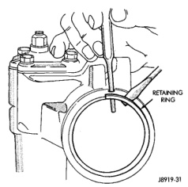
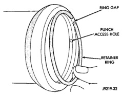
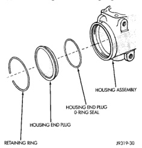

# DISASSEMBLY AND ASSEMBLY (Continued)

## HOUSING END PLUG (Continued)

*Fig. 4 End Plug Retaining Ring]*

*Fig. 4 End Plug Retaining Ring*

**CAUTION: Do not turn stub shaft any further than necessary. The rack piston balls will drop out of the rack piston circuit if the stub shaft is turned too far.**

(3) Remove O-ring from the housing (Fig. 5).

*Fig. 5 End Plug Components]*

*Fig. 5 End Plug Components*

### ASSEMBLY

(1) Lubricate O-ring with power steering fluid and install into the housing.

(2) Install end plug by tapping the plug lightly with a plastic mallet into the housing.

(3) Install retaining ring so one end of the ring covers the housing access hole (Fig. 6).

*Fig. 6 Installing The Retaining Ring]*

*Fig. 6 Installing The Retaining Ring*

---

## PITMAN SHAFT/SEALS/BEARING

### DISASSEMBLY

(1) Clean exposed end of pitman shaft and housing with a wire brush.

(2) Remove preload adjuster nut (Fig. 7).

(3) Rotate the stub shaft with a 12 point socket from stop to stop and count the number of turns.

(4) Center the stub shaft by rotating it from the stop 1/2 of the total amount of turns.

(5) Remove side cover bolts and remove side cover, gasket and pitman shaft as an assembly (Fig. 7).

**NOTE: The pitman shaft will not clear the housing if it is not centered.**

(6) Remove pitman shaft from the side cover.

(7) Remove dust seal from the housing with a seal pick (Fig. 8).

**CAUTION: Use care not to score the housing bore when prying out seals and washer.**

(8) Remove retaining ring with snap ring pliers.

(9) Remove washer from the housing.

(10) Remove oil seal from the housing with a seal pick.

(11) Remove pitman shaft bearing from housing with a bearing driver and handle (Fig. 9).

### ASSEMBLY

(1) Install pitman shaft bearing into housing with a bearing driver and handle.

(2) Coat the oil seals and washer with grease.

(3) Install the oil seal with a driver and handle.

(4) Install backup washer.

(5) Install the retainer ring with snap ring pliers.

*Source: 19 Steering, Page 13*
