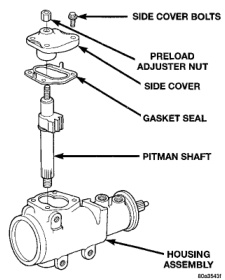
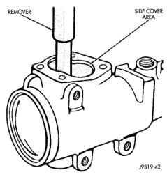
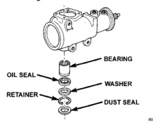
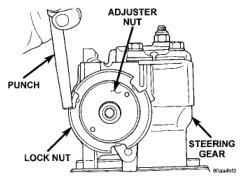

# DISASSEMBLY AND ASSEMBLY (Continued)

## PITMAN SHAFT/SEALS/BEARING (Continued)

*Fig. 7 Side Cover and Pitman Shaft]*

*Fig. 7 Side Cover and Pitman Shaft*

*Fig. 8 Pitman Shaft Seals & Bearing]*

*Fig. 8 Pitman Shaft Seals & Bearing*

(6) Install dust seal with a driver and handle.

(7) Install pitman shaft to side cover by screwing shaft in until it fully seats to side cover.

(8) Install preload adjuster nut. **Do not tighten nut until after Over-Center Rotation Torque adjustment has been made.**

(9) Install gasket to side cover and bend tabs around edges of side cover (Fig. 7).

(10) Install pitman shaft assembly and side cover to housing.

(11) Install side cover bolts and tighten to 60 N·m (44 ft. lbs.).

(12) Adjust Over-Center Rotation Torque.

*Fig. 9 Needle Bearing Removal]*

*Fig. 9 Needle Bearing Removal*

---

## SPOOL VALVE

### DISASSEMBLY

(1) Remove lock nut (Fig. 10).

(2) Remove adjuster nut with Spanner Wrench C-4381.

(3) Remove thrust support assembly out of the housing (Fig. 11).

(4) Pull stub shaft and valve assembly from the housing (Fig. 12).

*Fig. 10 Lock Nut and Adjuster Nut]*

*Fig. 10 Lock Nut and Adjuster Nut*

(5) Remove stub shaft from valve assembly by lightly tapping shaft on a block of wood to loosen shaft. Then disengage stub shaft pin from hole in spool valve and separate the valve assembly from stub shaft (Fig. 13).

*Source: 19 Steering, Page 14*
