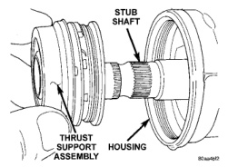
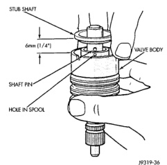
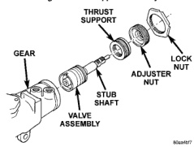
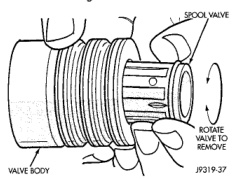

# DISASSEMBLY AND ASSEMBLY (Continued)

## SPOOL VALVE (Continued)

*Fig. 11 Thrust Support Assembly]*

*Fig. 11 Thrust Support Assembly*

*Fig. 12 Valve Assembly With Stub Shaft]*

*Fig. 12 Valve Assembly With Stub Shaft*

(6) Remove spool valve from valve body by pulling and rotating the spool valve from the valve body (Fig. 14).

(7) Remove spool valve O-ring and valve body teflon rings and O-rings underneath the teflon rings (Fig. 15).

(8) Remove the O-ring between the worm shaft and the stub shaft.

### ASSEMBLY

**NOTE: Clean and dry all components, then lubricate with power steering fluid.**

(1) Install spool valve spool O-ring.

(2) Install spool valve in valve body by pushing and rotating. Hole in spool valve for stub shaft pin must be accessible from opposite end of valve body.

(3) Install stub shaft in valve spool and engage locating pin on stub shaft into spool valve hole (Fig. 16).

*Fig. 14 Stub Shaft]*

*Fig. 14 Stub Shaft*

*Fig. 15 Spool Valve]*

*Fig. 15 Spool Valve*

**NOTE: Notch in stub shaft cap must fully engage valve body pin and seat against valve body shoulder.**

(4) Install O-rings and teflon rings over the O-rings on valve body.

(5) Install O-ring into the back of the stub shaft cap (Fig. 17).

(6) Install stub shaft and valve assembly in the housing. Line up worm shaft to slots in the valve assembly.

(7) Install thrust support assembly.

**NOTE: The thrust support is serviced as an assembly. If any component of the thrust support is damaged the assembly must be replaced.**

*Source: 19 Steering, Page 15*
