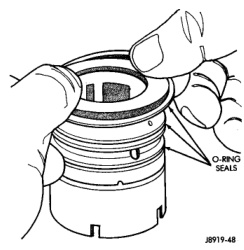
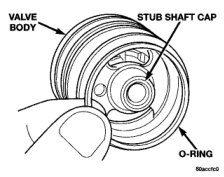
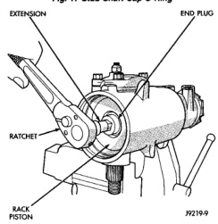
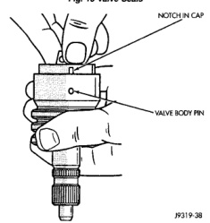

# DISASSEMBLY AND ASSEMBLY (Continued)

## SPOOL VALVE (Continued)

*Fig. 15 Valve Seals]*

*Fig. 15 Valve Seals*

*Fig. 16 Stub Shaft Installation]*

*Fig. 16 Stub Shaft Installation*

(8) Install adjuster nut and lock nut.

(9) Adjust Thrust Bearing Preload and Over-Center Rotating Torque.

---

## RACK PISTON AND WORM SHAFT

### DISASSEMBLY

(1) Remove housing end plug.

(2) Remove rack piston plug (Fig. 18).

(3) Remove side cover and pitman shaft.

*Fig. 17 Stub Shaft Cap O-Ring]*

*Fig. 17 Stub Shaft Cap O-Ring*

*Fig. 18 Rack Piston End Plug]*

*Fig. 18 Rack Piston End Plug*

(4) Turn stub shaft COUNTERCLOCKWISE until the rack piston begins to come out of the housing.

(5) Insert Arbor C-4175 into bore of rack piston (Fig. 19) and hold tool tightly against worm shaft.

(6) Turn the stub shaft with a 12 point socket COUNTERCLOCKWISE, this will force the rack piston onto the tool and hold the rack piston balls in place.

(7) Remove the rack piston and tool together from housing.

(8) Remove tool from rack piston.

(9) Remove rack piston balls.

(10) Remove clamp bolts, clamp and ball guide (Fig. 20).

(11) Remove teflon ring and O-ring from the rack piston (Fig. 21).

*Source: 19 Steering, Page 16*
