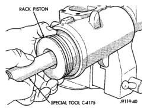
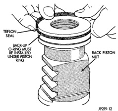
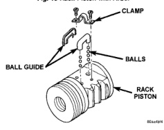
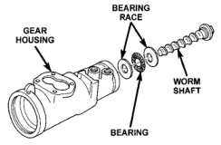

# DISASSEMBLY AND ASSEMBLY (Continued)

## RACK PISTON AND WORM SHAFT (Continued)

*Fig. 19 Rack Piston with Arbor]*

*Fig. 19 Rack Piston with Arbor*

*Fig. 20 Rack Piston]*

*Fig. 20 Rack Piston*

(12) Remove the adjuster lock nut and adjuster nut from the stub shaft.

(13) Pull the stub shaft with the spool valve and thrust support assembly out of the housing.

(14) Remove the worm shaft from the housing (Fig. 22).

### ASSEMBLY

**NOTE: Clean and dry all components and lubricate with power steering fluid.**

(1) Check for scores, nicks or burrs on the rack piston finished surface. Slight wear is normal on the worm gear surfaces.

(2) Install O-ring and teflon ring on the rack piston.

(3) Install worm shaft in the rack piston and align worm shaft spiral groove with rack piston ball guide hole (Fig. 23).

*Fig. 22 Rack Piston Teflon Ring and O-Ring]*

*Fig. 22 Rack Piston Teflon Ring and O-Ring*

*Fig. 23 Worm Shaft]*

*Fig. 23 Worm Shaft*

**CAUTION: The rack piston balls must be installed alternately into the rack piston and ball guide. This maintains worm shaft preload. There are 12 black balls and 12 silver (Chrome) balls. The black balls are smaller than the silver balls.**

(4) Lubricate and install rack piston balls through return guide hole while turning worm shaft COUNTERCLOCKWISE (Fig. 23).

(5) Install remaining balls in guide using grease to hold the balls in place (Fig. 24).

(6) Install the guide onto rack piston and install clamp and clamp bolts. Tighten bolts to 58 N·m (43 ft. lbs.).

(7) Insert Arbor C-4175 into bore of rack piston and hold tool tightly against worm shaft.

*Source: 19 Steering, Page 17*
