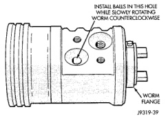
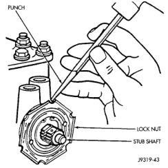
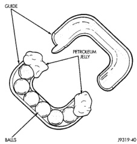

# DISASSEMBLY AND ASSEMBLY (Continued)

## RACK PISTON AND WORM SHAFT (Continued)

*Fig. 23 Installing Balls in Rack Piston]*

*Fig. 22 Installing Balls in Rack Piston*

*Fig. 24 Balls in the Return Guide]*

*Fig. 23 Balls in the Return Guide*

(8) Turn the worm shaft COUNTERCLOCKWISE while pushing on the arbor. This will force the rack piston onto the arbor and hold the rack piston balls in place.

(9) Install the races and thrust bearing on the worm shaft and install shaft in the housing (Fig. 22).

(10) Install the stub shaft with spool valve, thrust support assembly and adjuster nut in the housing.

(11) Install the rack piston and arbor tool into the housing.

(12) Hold arbor tightly against worm shaft and turn stub shaft CLOCKWISE until rack piston is seated on worm shaft.

(13) Install pitman shaft and side cover in the housing.

(14) Install rack piston plug and tighten to 150 N·m (111 ft. lbs.).

(15) Install housing end plug.

(16) Adjust worm shaft thrust bearing preload and over-center rotating torque.

---

# ADJUSTMENTS

## STEERING GEAR

**CAUTION: Steering gear must be adjusted in the proper order. If adjustments are not performed in order, gear damage and improper steering response may result.**

**NOTE: Adjusting the steering gear in the vehicle is not recommended. Remove gear from the vehicle and drain the fluid. Then mount gear in a vise to perform adjustments.**

### WORM THRUST BEARING PRELOAD

(1) Mount the gear carefully into a vise.

**CAUTION: Do not overtighten the vise on the gear case. This may affect the adjustment.**

(2) Remove adjuster plug locknut (Fig. 25).

(3) Rotate the stub shaft back and forth with a 12 point socket to drain the remaining fluid.

*Fig. 22 Loosening the Adjuster Plug]*

*Fig. 24 Loosening the Adjuster Plug*

(4) Turn the adjuster in with Spanner Wrench C-4381. Tighten the plug and thrust bearing in the

*Source: 19 Steering, Page 18*
