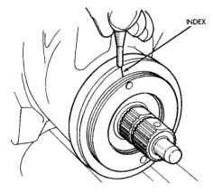
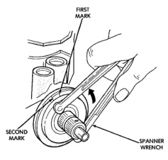
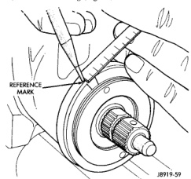
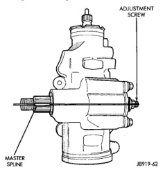

# ADJUSTMENTS (Continued)

## WORM THRUST BEARING PRELOAD (Continued)

housing until firmly bottomed in the housing about 34 N·m (25 ft. lbs.).

(5) Place an index mark on the housing even with one of the holes in adjuster plug (Fig. 26).

*Fig. 26 Alignment Marking On Housing]*

*Fig. 26 Alignment Marking On Housing*

(6) Measure back (counterclockwise) 10 mm (0.40 in) and mark housing (Fig. 27).

*Fig. 27 Second Marking On Housing]*

*Fig. 27 Second Marking On Housing*

(7) Rotate adjustment cap back (counterclockwise) with spanner wrench until hole is aligned with the second mark (Fig. 28).

(8) Install and tighten locknut to 108 N·m (80 ft. lbs.). Be sure adjustment cap does not turn while tightening the locknut.

*Fig. 28 Aligning To The Second Mark]*

*Fig. 28 Aligning To The Second Mark*

---

## OVER-CENTER

**NOTE: Before performing this procedure, the worm bearing preload adjustment must be performed.**

(1) Rotate the stub shaft with a 12 point socket from stop to stop and count the number of turns.

(2) Starting at either stop, turn the stub shaft back 1/2 the total number of turns. This is the center of the gear travel (Fig. 29).

*Fig. 29 Steering Gear Centered]*

*Fig. 29 Steering Gear Centered*

*Source: 19 Steering, Page 19*
