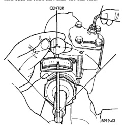

# ADJUSTMENTS (Continued)

## OVER-CENTER (Continued)

(3) Place the torque wrench in the vertical position on the stub shaft. Rotate the wrench 45 degrees each side of the center and record the highest rotational torque in this range (Fig. 30). This is the Over-Center Rotating Torque.

**NOTE: The stub shaft must rotate smoothly without sticking or binding.**

(4) Rotate the stub shaft between 90 degrees and 180 degrees to the left of center and record the left off-center preload. Repeat this to the right of center and record the right off-center preload. The average of these two recorded readings is the Preload Rotating Torque.

(5) The Over-Center Rotating Torque should be 0.45-0.9 N·m (4-8 in. lbs.) **higher** than the Preload Rotating Torque.

(6) If an adjustment to the Over-Center Rotating Torque is necessary, first loosen the adjuster lock nut. Then turn the pitman shaft adjuster screw back (COUNTERCLOCKWISE) until fully extended, then turn back in (CLOCKWISE) one full turn.

*Fig. 30 Checking Over-center Rotation Torque]*

*Fig. 30 Checking Over-center Rotation Torque*

(7) Remeasure Over-Center Rotating Torque. If necessary turn the adjuster screw and repeat measurement until correct Over-Center Rotating Torque is reached.

**NOTE: To increase the Over-Center Rotating Torque turn the screw CLOCKWISE.**

(8) Prevent the adjuster screw from turning while tightening adjuster lock nut. Tighten the adjuster lock nut to 49 N·m (36 ft. lbs.).

---

# SPECIFICATIONS

## POWER STEERING GEAR

| Steering Gear | |
|---|---|
| Type | Recirculating Ball |
| **Gear Code & Ratio** | |
| BN | 17.5:1 |
| HF | 16-13:1 |
| **Wormshaft Bearing** | |
| Preload | 0.45-1.13 N·m (10-15 in. lbs.) |
| **Pitman Shaft Overcenter Drag** | |
| New Gear (under 400 miles) | 0.45-0.90 N·m (6-10 in. lbs.) + Wormshaft Preload |
| Used Gear (over 400 miles) | 0.5-0.6 N·m (4-5 in. lbs.) + Wormshaft Preload |

## TORQUE CHART

| DESCRIPTION | TORQUE |
|---|---|
| **Steering Gear Mounting** | |
| Frame Bolts | 176 N·m (130 ft. lbs.) |
| **Line Fittings** | |
| Pressure | 31 N·m (23 ft. lbs.) |
| Return | 31 N·m (23 ft. lbs.) |
| **Steering Gear** | |
| Adjustment Cap Locknut | 108 N·m (80 ft. lbs.) |
| Adjustment Screw Locknut | 58 N·m (43 ft. lbs.) |
| Pitman Shaft Nut | 251 N·m (185 ft. lbs.) |
| Rack Piston Plug | 149 N·m (110 ft. lbs.) |
| Side Cover Bolts | 61 N·m (45 ft. lbs.) |
| Return Guide Clamp Bolt | 5 N·m (4 ft. lbs.) |

*Source: 19 Steering, Page 20*
