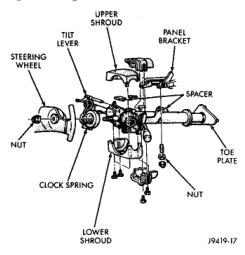

# STEERING COLUMN

## INDEX

| | page |
|---|---|
| **GENERAL INFORMATION** | |
| STEERING COLUMN | 22 |
| **DIAGNOSIS AND TESTING** | |
| IGNITION SWITCH | 22 |
| **REMOVAL AND INSTALLATION** | |
| GEAR SHIFT LEVER | 25 |
| **SPECIFICATIONS** | |
| TORQUE CHART | 25 |
| **STEERING COLUMN** | 23 |

## GENERAL INFORMATION

### STEERING COLUMN

The tilt and standard column (Fig. 1) has been designed to be serviced as an assembly; less wiring, switches, shrouds, steering wheel, etc. Most steering column components can be serviced without removing the steering column from the vehicle.

*Fig. 1 Steering Column]*

### SERVICE PRECAUTIONS

Safety goggles should be worn at all times when working on steering columns.

To service the steering wheel, switches or the airbag, refer to the appropriate section of Group 8. Follow all WARNINGS.

**WARNING: THE AIRBAG SYSTEM IS A SENSITIVE, COMPLEX ELECTRO-MECHANICAL UNIT. BEFORE ATTEMPTING TO DIAGNOSE, REMOVE OR INSTALL THE AIRBAG SYSTEM COMPONENTS YOU MUST FIRST DISCONNECT AND ISOLATE THE BATTERY NEGATIVE (GROUND) CABLE. THEN WAIT TWO MINUTES FOR THE SYSTEM CAPACITOR TO DISCHARGE. FAILURE TO DO SO COULD RESULT IN ACCIDENTAL DEPLOYMENT OF THE AIRBAG AND POSSIBLE PERSONAL INJURY. THE FASTENERS, SCREWS, AND BOLTS, ORIGINALLY USED FOR THE AIRBAG COMPONENTS, HAVE SPECIAL COATINGS AND ARE SPECIFICALLY DESIGNED FOR THE AIRBAG SYSTEM. THEY MUST NEVER BE REPLACED WITH ANY SUBSTITUTES. ANYTIME A NEW FASTENER IS NEEDED, REPLACE WITH THE CORRECT FASTENERS PROVIDED IN THE SERVICE PACKAGE OR FASTENERS LISTED IN THE PARTS BOOKS.**

**WARNING: THE AIRBAG SYSTEM IS A SENSITIVE, COMPLEX ELECTRO-MECHANICAL UNIT.**

**CAUTION:** Do not hammer on steering column shaft or shift tube. This may cause the shaft or shift tube to collapse.

**CAUTION:** Do not attempt to remove the pivot pins to disassemble the tilting mechanism. Do not remove ignition locking link, shaft lock plate or plate retainer. This will damage the column (Fig. 2) and (Fig. 3).

## DIAGNOSIS AND TESTING

### IGNITION SWITCH

#### TEST AND REPAIR

If the ignition switch effort is excessive, remove the ignition switch from the steering column. Refer to Group 8D Ignition System. Using a key cylinder,

*Source: 19 Steering, Page 22*
