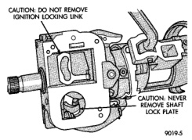
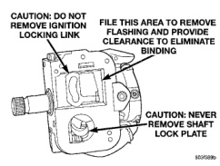
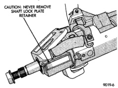

# DIAGNOSIS AND TESTING (Continued)

*Fig. 2 Observe Cautions]*

*Fig. 3 Observe Cautions]*

check the turning effort of the switch. If the ignition switch binds look for the following conditions.

(1) Look for rough areas or flash in the casting and if found remove with a file (Fig. 4).

(2) Remove the link and slider and check the link to see if it is bent. If so replace with a new part.

(3) Put the slider in its slot in the sleeve and verify a loose fit over the length of the slot. If the slider binds in the slot at any point lightly file the slider until clearance is achieved.

(4) If no binding is found, lightly file the ramp on the ignition switch, (The ramp fits into the casting) until binding no longer occurs.

*Fig. 4 Steering Column Flash Removal And Non-Serviceable Components]*

## REMOVAL AND INSTALLATION

### STEERING COLUMN

**WARNING: BEFORE SERVICING THE STEERING COLUMN THE AIRBAG SYSTEM MUST BE DISARMED. REFER TO GROUP 8M RESTRAINT SYSTEMS FOR SERVICE PROCEDURES. FAILURE TO DO SO MAY RESULT IN ACCIDENTAL DEPLOYMENT OF THE AIRBAG AND POSSIBLE PERSONAL INJURY.**

**CAUTION:** All fasteners must be torqued to specification to ensure proper operation of the steering column.

#### REMOVAL

(1) Position front wheels straight ahead.

(2) Remove the negative (ground) cable from the battery.

(3) Remove airbag, refer to Group 8M Restraint Systems for procedures.

(4) Remove the steering wheel with an appropriate puller.

**CAUTION:** Ensure the puller bolts are fully engaged into the steering wheel and not into the clockspring, before attempting to remove the wheel. Failure to do so may damage the steering wheel.

(5) Remove the shift link rod in engine compartment (if equipped). Pry rod out from grommet in the shift lever.

(6) Scribe or paint reference mark on the column shaft-to-coupler. This will aid in column shaft installation alignment. Remove the steering column shaft-to-coupler bolt (Fig. 5).

(7) Remove the steering column opening cover/knee blocker, refer to Group 8E Instrument Panel Systems.

(8) Remove PRNDL cable on column shift vehicles. Put shift lever in Park position. Pull cable and twist to remove from position arm. Push tab up on bottom

*Source: 19 Steering, Page 23*
