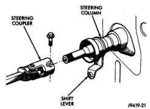
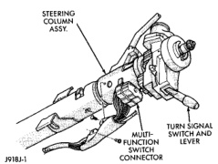
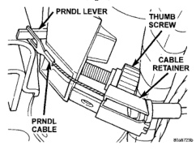
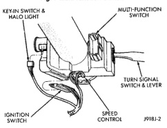

# REMOVAL AND INSTALLATION (Continued)

*Fig. 5 Steering Coupler]*

of cable retainer, then squeeze sides to remove retainer from column (Fig. 6).

*Fig. 6 PRNDL Drive Cable]*

(9) Remove tilt lever (if equipped) from column.

(10) Remove the upper and lower lock housing shroud and remove the lower fixed shroud.

(11) Remove the turn signal multi-function switch with a 7mm socket (Fig. 7).

(12) Loosen the upper Support Bracket nuts to allow some slack. This will aid in removal of the upper fixed shroud.

(13) Remove electrical connections from Key-in light, Ignition Switch, Horn and Clock Spring (Speed Control) (Fig. 8).

(14) Remove the wiring harness from the column by prying out the plastic retainer buttons.

(15) Remove toe plate fasteners.

(16) Remove column from vehicle.

(17) Remove clock spring and switches, refer to Group 8 Electrical for procedures.

*Fig. 7 Multi-function Switch]*

*Fig. 8 Steering Column Wiring]*

### INSTALLATION

(1) Install clock spring and switches, refer to Group 8 Electrical for procedures.

(2) Column shift vehicles, install a new grommet. Use multi-purpose lubricant, or equivalent, to aid installation of the grommet.

**NOTE: A new grommet should be used when ever the rod is disconnected from the lever.**

(3) Remove the shipping lock pin if necessary.

(4) Install the ground clip on the left spacer slot.

(5) Install column through floor pan.

(6) Position the column bracket breakaway capsules on the mounting studs. Install, but loose assemble the two upper bracket nuts.

(7) With the front wheels in the straight-ahead position. Align steering column shaft to the coupler. Install a new pinch bolt and tighten to 49 N-m (36 ft. lbs.).

*Source: 19 Steering, Page 24*
