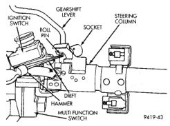

# REMOVAL AND INSTALLATION (Continued)

(8) Clip the wiring harness on the steering column. Connect the multi-function switch wiring and tighten with 7mm socket.

(9) Install the upper fixed shroud.

(10) Be sure both breakaway capsules are fully seated in the slots in the column support bracket. Tighten upper bracket nuts to 12 N-m (105 in. lbs.).

(11) Tighten the toe plate to floor pan attaching nuts to 22.5 N-m (200 in. lbs.).

(12) Install the wiring connections to the column. Install the lower fixed shroud.

(13) Column shift vehicles, install the PRNDL driver cable. Place shifter in Park position. If indicator needs adjusting, turn thumb screw on cable retainer to adjust cable.

(14) Install the lock housing shrouds. Install the tilt lever (if equipped).

(15) Install the knee blocker and steering column opening cover, refer to Group 8E Instrument Panel Systems.

(16) Install steering wheel and tighten nut to 61 N-m (45 ft. lbs.).

(17) Install airbag, refer to Group 8M Restraint Systems.

(18) Column shift vehicles, connect the shift link rod to the transmission shift lever. Use multi-purpose lubricant, or an equivalent product, to aid the installation.

(19) Install the battery ground (negative) cable.

(20) Verify operation of the automatic transmission shift linkage and adjust as necessary. Refer to Group 21, Transmission for adjustment procedure.

## GEAR SHIFT LEVER

### REMOVAL

(1) Support the steering column assembly as shown in (Fig. 9) using a suitable size socket.

(2) Using a drift of the appropriate size drive the roll pin out of the steering column and gear shift lever. Remove the gear shift lever from the steering column assembly.

*Fig. 9 Gear Shift Lever]*

### INSTALLATION

(1) Support the steering column using a suitable size socket.

(2) Install the gear shift lever into the steering column assembly. Align the roll pin holes in the gear shift lever and the steering column assembly.

(3) Carefully Install the roll pin into the steering column assembly and through the shift lever. If the roll pin binds check the alignment on the holes. Be sure roll pin is fully installed into the steering column assembly.

## SPECIFICATIONS

### TORQUE CHART

| Description | Torque |
|---|---|
| **Steering Wheel** | |
| Nut | 61 N-m (45 ft. lbs.) |
| **Steering Coupler** | |
| Bolt | 49 N-m (36 ft. lbs.) |
| **Steering Column** | |
| Upper Bracket | 12 N-m (105 in. lbs.) |
| Toe Plate | 23 N-m (200 in. lbs.) |

*Source: 19 Steering, Page 25*
