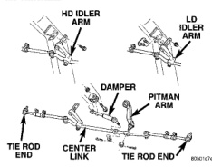
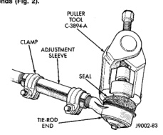

# STEERING LINKAGE - IFS SUSPENSION

## INDEX

| | page |
|---|---|
| **GENERAL INFORMATION** | |
| IFS-STEERING LINKAGE | 26 |
| **REMOVAL AND INSTALLATION** | |
| STEERING LINKAGE | 26 |
| **SPECIFICATIONS** | |
| TORQUE CHART | 27 |
| **SPECIAL TOOLS** | |
| STEERING LINKAGE | 27 |

## GENERAL INFORMATION

### IFS-STEERING LINKAGE

Light duty (LD) and heavy duty (HD) steering linkage is used with IFS suspensions (Fig. 1). Heavy duty linkage is used on 8800 and 10500 lb. GVW vehicles. Vehicles with 10500 lb. GVW rating have a steering damper mounted from a frame bracket to the centerlink.

*Fig. 1 Steering Linkage]*

**CAUTION:** If any steering components are replaced or serviced an alignment must be performed.

**CAUTION:** Components attached with a nut and cotter pin must be torqued to specification. Then if the slot in the nut does not line up with the cotter pin hole, tighten nut until it is aligned. Never loosen the nut to align the cotter pin hole.

**NOTE:** Periodic lubrication of the steering system components is required. Refer to Group 0, Lubrication And Maintenance for the recommended maintenance schedule.

**NOTE:** When servicing the steering linkage, use care to avoid damaging ball stud seals. Use Puller C-3894-A or an appropriate puller to remove tie rod ends (Fig. 2).

*Fig. 2 Tie Rod End]*

## REMOVAL AND INSTALLATION

### STEERING LINKAGE

#### REMOVAL

(1) Remove the cotter pin and nut from the tie-rod.

(2) Remove the tie-rod end ball studs from the steering knuckles with an appropriate puller.

(3) Remove inner tie-rod ends from center link.

(4) If equipped remove steering damper from center link and frame bracket.

(5) Remove idler arm ball stud from center link with an appropriate puller. Remove idler arm mounting nuts (LD) or mounting bolts (HD) from frame bracket.

(6) Remove pitman arm ball stud from center link.

(7) Mark the pitman arm and shaft positions for installation reference. Remove pitman arm with Puller C-4150A (Fig. 3).

*Source: 19 Steering, Page 26*
