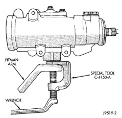
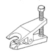
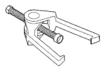
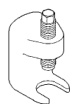

# REMOVAL AND INSTALLATION (Continued)

*Fig. 3 Pitman Arm]*

#### INSTALLATION

(1) Position idler arm on the frame bracket and tighten the mounting nuts (LD) or bolts (HD) to specification.

(2) Center steering gear to alignment marks and install pitman arm.

(3) Install the lock washer and retaining nut on the pitman shaft. Tighten the nut to 251 N-m (185 ft. lbs.).

(4) Install center link to ball studs and tighten retaining nuts to 88 N-m (65 ft. lbs.). Install new cotter pins.

(5) Install tie-rod ends into center link and tighten the nuts to 88 N-m (65 ft. lbs.). Install new cotter pins.

(6) Install steering damper to frame bracket and center link (if equipped). Tighten frame mounting nut to 108 N-m (80 ft. lbs.). Tighten center link mounting nut to 68 N-m (50 ft. lbs.) and install a new cotter pin.

(7) Install tie-rod ends into steering knuckles and tighten nuts to 88 N-m (65 ft. lbs.). Install new cotter pins.

(8) Remove the supports and lower the vehicle to the surface. Center steering wheel and adjust toe (refer to the Alignment Specifications chart within Group 2, Front Suspension).

**NOTE: Position the clamp on the sleeve so retaining bolt is located on the bottom side of the sleeve.**

(9) After adjustment, tighten the tie-rod adjustment sleeve clamp bolt to 54 N-m (40 ft. lbs.).

## SPECIFICATIONS

### TORQUE CHART

| Description | Torque |
|---|---|
| **Pitman Arm** | |
| Ball Stud Nut | 88 N-m (65 ft. lbs.) |
| Shaft Nut | 251 N-m (185 ft. lbs.) |
| **Idler Arm** | |
| Ball Stud Nut | 88 N-m (65 ft. lbs.) |
| Mounting Nuts LD | 68 N-m (50 ft. lbs.) |
| Mounting Bolts HD | 264 N-m (195 ft. lbs.) |
| **Steering Damper** | |
| Frame Nut | 108 N-m (80 ft. lbs.) |
| Center Link Nut | 68 N-m (50 ft. lbs.) |
| **Tie Rod** | |
| Ball Stud Nut | 88 N-m (65 ft. lbs.) |
| Tie Rod Clamp | 61 N-m (45 ft. lbs.) |

## SPECIAL TOOLS

### STEERING LINKAGE

*Fig. 2 Remover Ball Stud MB-991113*

*Remover Ball Stud MB-991113*

*Fig. 4 Puller Tie Rod C-3894-A*

*Puller Tie Rod C-3894-A*

*Fig. 5 Remover Pitman C-4150A*

*Remover Pitman C-4150A*

*Source: 19 Steering, Page 27*
