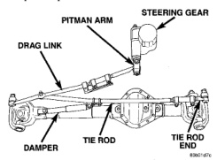
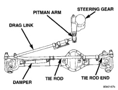
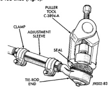

# STEERING LINKAGE - LINK/COIL SUSPENSION

## INDEX

| | page |
|---|---|
| **GENERAL INFORMATION** | |
| LINK/COIL-STEERING LINKAGE | 28 |
| **REMOVAL AND INSTALLATION** | |
| STEERING LINKAGE | 29 |
| **SPECIFICATIONS** | |
| TORQUE CHART | 29 |
| **SPECIAL TOOLS** | |
| STEERING LINKAGE | 30 |

## GENERAL INFORMATION

### LINK/COIL-STEERING LINKAGE

A light duty (LD) steering linkage (Fig. 1) is used on 6400, 6600 and 7500 lb. GVW vehicles. A heavy duty (HD) steering linkage (Fig. 2) is used on 8800 and 11000 lb. GVW vehicles. The steering linkage is comprised of a tie rod end, tie rod, drag link, steering damper and pitman arm.

*Fig. 1 Light Duty Steering Linkage]*

**CAUTION:** If any steering components are replaced or serviced an alignment must be performed.

**CAUTION:** Components attached with a nut and cotter pin must be torqued to specification. Then if the slot in the nut does not line up with the cotter pin hole, tighten nut until it is aligned. Never loosen the nut to align the cotter pin hole.

**NOTE:** Periodic lubrication of the steering system components is required. Refer to Group 0, Lubrication And Maintenance for the recommended maintenance schedule.

*Fig. 2 Heavy Duty Steering Linkage]*

**NOTE:** To avoid damaging ball stud seals, use Puller C-3894-A or an appropriate puller to remove tie rod ends (Fig. 3).

*Fig. 3 Tie Rod End]*

*Source: 19 Steering, Page 28*
