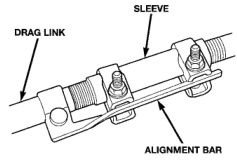

# REMOVAL AND INSTALLATION

## STEERING LINKAGE

**NOTE:** Do not loosen/move alignment bar or alignment bar clamp (Fig. 4). The bar is used as a locator for the adjuster clamps.

*Fig. 2 Alignment Bar]*

### REMOVAL

(1) Remove tie rod from drag link.

(2) Remove steering damper from drag link with Puller C-4150A.

(3) Remove drag link tie rod end from steering knuckle and pitman arm.

(4) Mark the pitman arm and shaft positions for installation reference. Remove the nut and washer from the pitman arm. Remove the pitman arm with Puller C-4150A.

(5) Remove tie rod from steering knuckle.

### INSTALLATION

**NOTE:** When installing linkage tighten nuts to proper torque, then align cotter pin slot by tightening nut if necessary.

(1) Align reference marks and install pitman arm.

(2) Install the lock washer and retaining nut on the pitman shaft and tighten nut to 251 N-m (185 ft. lbs.).

(3) Install drag link ball studs to steering knuckle and pitman arm. Install the retaining nuts and tighten to 88 N-m (65 ft. lbs.). Install new cotter pins.

(4) Install tie rod on steering knuckle and drag link. Tighten the nuts to 88 N-m (65 ft. lbs.). Install new cotter pins.

(5) Install steering damper on drag link and tighten nut to 68 N-m (50 ft. lbs.). Install new cotter pin.

(6) Remove the supports and lower the vehicle to the surface. Center steering wheel and adjust toe, refer to Group 2 Suspension.

(7) After adjustment tighten tie rod adjustment sleeve clamp bolts to 54 N-m (40 ft. lbs.).

**NOTE: Position the clamp on the sleeve so retaining bolt is located on the bottom side of the sleeve.**

## SPECIFICATIONS

### TORQUE CHART

| Description | Torque |
|---|---|
| **Pitman Arm** | |
| Shaft | 251 N-m (185 ft. lbs.) |
| **Drag Link** | |
| Ball Stud | 88 N-m (65 ft. lbs.) |
| **Tie Rod End** | |
| Ball Stud | 88 N-m (65 ft. lbs.) |
| Clamp | 54 N-m (40 ft. lbs.) |
| **Tie Rod** | |
| Ball Stud | 88 N-m (65 ft. lbs.) |
| **Steering Damper** | |
| Frame | 88 N-m (65 ft. lbs.) |
| Drag Link | 68 N-m (50 ft. lbs.) |

*Source: 19 Steering, Page 29*
