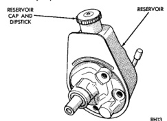
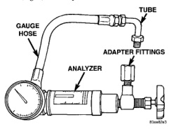

# POWER STEERING PUMP

## INDEX

| DESCRIPTION AND OPERATION | Page | REMOVAL AND INSTALLATION | Page |
|---------------------------|------|--------------------------|------|
| POWER STEERING PUMP | 4 | POWER STEERING PUMP - GASOLINE ENGINE | 7 |
| **DIAGNOSIS AND TESTING** | | POWER STEERING PUMP - DIESEL ENGINE | 7 |
| PUMP FLOW RATE AND PRESSURE | 4 | **DISASSEMBLY AND ASSEMBLY** | |
| PUMP LEAKAGE DIAGNOSIS | 5 | PUMP PULLEY | 9 |
| **SERVICE PROCEDURES** | | **SPECIFICATIONS** | |
| FLUSHING POWER STEERING SYSTEM | 6 | TORQUE CHART | 10 |
| POWER STEERING PUMP - INITIAL OPERATION | 5 | **SPECIAL TOOLS** | |
| | | POWER STEERING PUMP | 10 |

## DESCRIPTION AND OPERATION

### POWER STEERING PUMP

The P-Series pump is used on these vehicles (Fig. 1).

Hydraulic pressure is provided for the power steering gear by the belt driven power steering pump. The power steering pump is a constant flow rate and displacement, vane-type pump.

The pump is connected to the steering gear via the pressure hose and the return hose. The pump shaft has a pressed-on pulley that is belt driven by the crankshaft pulley.

Trailer tow option vehicles are equipped with a power steering pump oil cooler. The oil cooler is mounted to the radiator support.

**NOTE: Power steering pumps are not interchangeable with pumps installed on other vehicles.**

*Fig. 1 P-Series Pump]*

## DIAGNOSIS AND TESTING

### PUMP FLOW RATE AND PRESSURE

The following procedure is used to test the operation of the power steering system on the vehicle. This test will provide the flow rate of the power steering pump along with the maximum relief pressure. Perform test any time a power steering system problem is present. This test will determine if the power steering pump or power steering gear is not functioning properly. The following pressure and flow test is performed using Power Steering Analyzer Tool kit 6815 (Fig. 2) and Adapter Kit 6893.

*Fig. 2 Pressure Test Gauge]*

### POWER STEERING ANALYZER INSTALLATION

#### WITHOUT HYDRAULIC BOOSTER

(1) Remove the high pressure hose from the power steering pump.

(2) Connect Tube 6844 into the pump hose fitting.

*Source: 19 Steering, Page 4*
