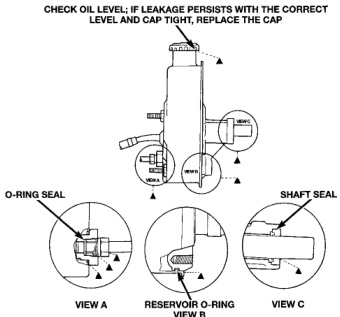

# SERVICE PROCEDURES (Continued)

### PUMP LEAKAGE

**CHECK OIL LEVEL; IF LEAKAGE PERSISTS WITH THE CORRECT LEVEL AND CAP TIGHT, REPLACE THE CAP**

*Fig. 1 Pump Leakage Diagnosis - View A: O-Ring Seal, View B: Reservoir O-Ring, View C: Shaft Seal]*

(8) Stop the engine and check the fluid level and refill as required.

(9) If the fluid is extremely foamy or milky looking, allow the vehicle to stand a few minutes and repeat the procedure.

**CAUTION: Do not run a vehicle with foamy fluid for an extended period. This may cause pump damage.**

### FLUSHING POWER STEERING SYSTEM

Flushing is required when the power steering/hydraulic booster system fluid has become contaminated. Contaminated fluid in the steering/booster system can cause seal deterioration and affect steering gear/booster spool valve operation.

(1) Raise the front end of the vehicle off the ground until the wheels are free to turn.

(2) Remove the return line from the pump.

**NOTE: If vehicle is equipped with a hydraulic booster remove both return lines from the pump.**

(3) Plug the return line port/ports at the pump.

(4) Position the return line/lines into a large container to catch the fluid.

(5) While an assistant is filling the pump reservoir start the engine.

(6) With the engine running at idle turn the wheel back and forth.

**NOTE: Do not contact or hold the wheel against the steering stops.**

(7) Run a quart of fluid through the system then stop the engine and install the return line/lines.

(8) Fill the system with fluid and perform Steering Pump Initial Operation.

(9) Start the engine and run it for fifteen minutes then stop the engine.

(10) Remove the return line/lines from the pump and plug the pump port/ports.

(11) Pour fresh fluid into the reservoir and check the draining fluid for contamination. If the fluid is still contaminated, disassemble and clean the steering gear and flush the system again.

(12) Install the return line/lines and perform Steering Pump Initial Operation.

*Source: 19 Steering, Page 6*
