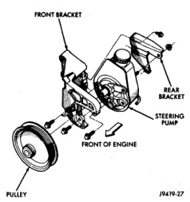
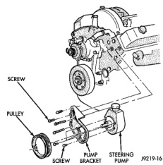

# REMOVAL AND INSTALLATION

## POWER STEERING PUMP - GASOLINE ENGINE

**WARNING: DO NOT REMOVE THE WATER PUMP COOLANT TUBE UNLESS THE COOLANT SYSTEM HAS BEEN DEPRESSURIZED AND DRAINED.**

### REMOVAL

(1) Remove the serpentine drive belt, refer to Group 7 Cooling.

(2) Remove the hoses from the power steering pump and cap the fittings.

(3) Remove battery ground cable and unthread stud from cylinder head, do not remove from bracket.

(4) Loosen upper bracket bolt and remove the lower bracket to engine block bolts.

(5) Pivot the pump assembly past the coolant tube.

(6) Remove the upper stud and remove upper bolt from cylinder head.

(7) Remove steering pump and mounting bracket from engine as an assembly.

(8) Remove the pump pulley, to access pump attaching bolts.

(9) Remove the front pump bracket (Fig. 3). On 8.0L engine remove rear pump bracket (Fig. 4).

*Fig. 4 Pump Mounting 3.9L, 5.2L and 5.9L]*

### INSTALLATION

(1) Install the front pump bracket and tighten bolts to 47 N·m (35 ft. lbs.). On 8.0L engine install rear pump bracket and tighten nut to 47 N·m (35 ft. lbs.), tighten bolts to 24 N·m (18 ft. lbs.).

(2) Install the pump pulley.

*Fig. 5 Pump Mounting 8.0L]*

(3) Install steering pump assembly on the engine block. Install the upper stud and bolt in bracket.

(4) Pivot the pump down past the coolant tube and install the lower bolts in bracket.

(5) Tighten the bolts and nut to 41 N·m (30 ft. lbs.).

(6) Connect the hoses to the pump.

(7) Install the serpentine drive belt refer to Group 7, Cooling for belt routing.

(8) Fill the reservoir with power steering fluid, refer to Pump Initial Operation.

## POWER STEERING PUMP - DIESEL ENGINE

### REMOVAL

(1) Remove and cap steering pump hoses and vacuum pump vacuum line.

(2) Remove the sender unit from engine block and plug hole in block (Fig. 5).

(3) Remove and cap the oil feed line from the bottom of the vacuum pump (Fig. 6).

(4) Remove the lower bolt that attaches the vacuum/steering pump assembly to the engine block. Remove the nut from the steering pump attaching bracket (Fig. 6).

(5) Remove upper bolt from the pump assembly (Fig. 7) and remove the assembly.

(6) Remove the mounting gasket.

(7) Remove the steering pump to vacuum pump bracket attaching nuts (Fig. 8).

(8) Slide the steering pump from the bracket. Use care not to damage the internal oil seal in the vacuum pump (Fig. 9).

*Source: 19 Steering, Page 7*
