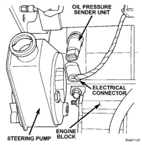
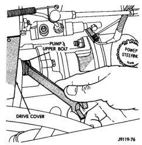
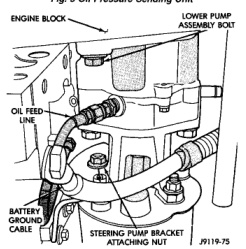
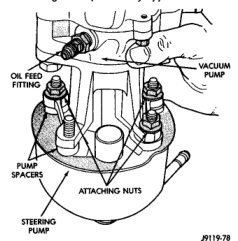

# REMOVAL AND INSTALLATION (Continued)

*Fig. 5 Oil Pressure Sending Unit]*

*Fig. 6 Oil Feed Line]*

(9) Remove the two pump body spacers.

### INSTALLATION

(1) Install the two pump body spacers.

(2) Rotate the drive gear until the steering pump and vacuum pump drive dogs align. Install the steering pump onto the vacuum pump bracket. Use care to avoid damaging the oil seal in the vacuum pump during installation. The steering pump housing

*Fig. 7 Pump Assembly Upper Bolt]*

*Fig. 8 Bracket Mounting Nuts]*

and spacers must mate completely with the vacuum pump bracket.

(3) Install the vacuum pump bracket to steering pump nuts and tighten to 24 N·m (18 ft. lbs.).

(4) Position new gasket on vacuum pump assembly. Use sealer if necessary to retain the gasket.

(5) Align and install the pump assembly on the engine. Ensure the steering pump stud is inserted

*Source: 19 Steering, Page 8*
