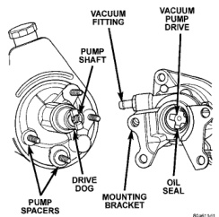
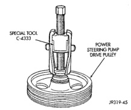
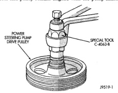

# REMOVAL AND INSTALLATION (Continued)

*Fig. 9 Steering Pump & Vacuum Pump]*

into the block bracket. Tighten the pump-to-engine block attaching bolts to 77 N·m (57 ft. lbs.).

(6) Install the steering pump to attaching bracket nut and tighten to 24 N·m (18 ft. lbs.).

(7) Remove plug and install the oil pressure sending unit and electrical connector.

(8) Install the oil feed line to the vacuum pump. Tighten the oil line connection to 7 N·m (60 in. lbs./ 5 ft. lbs.).

(9) Install the fluid hoses to the power steering pump. Tighten the pressure fitting at the pump to 31 N·m (23 ft. lbs.).

(10) Install and clamp the hose on the vacuum pump.

(11) Fill the reservoir with power steering fluid, refer to Pump Initial Operation.

(12) Start the engine and check the operation of the brakes.

## DISASSEMBLY AND ASSEMBLY

### PUMP PULLEY

#### DISASSEMBLY

(1) Remove pump assembly.

(2) Remove pulley from pump with Puller C-4333 (Fig. 10).

(1) Replace pulley if bent, cracked, or loose.

*Fig. 10 Pulley Removal]*

#### ASSEMBLY

(2) Install pulley on pump with Installer C-4063-B (Fig. 11) flush with the end of the shaft. Ensure the tool and pulley remain aligned with the pump shaft.

*Fig. 11 Pulley Installation]*

(3) Install pump assembly.

(4) With Serpentine Belts; Run engine until warm (5 min.) and note any belt chirp. If chirp exists, move pulley outward approximately 0.5 mm (0.020 in.). If noise increases, press on 1.0 mm (0.040 in.). Be careful that pulley does not contact mounting bolts.

*Source: 19 Steering, Page 9*
