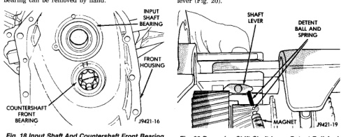
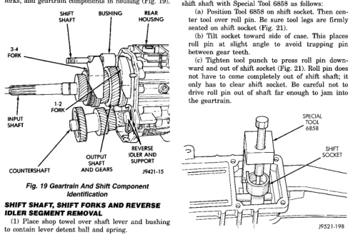

*Fig. 18*

(15) Remove input shaft bearing and countershaft front bearing from front case (Fig. 18). Countershaft bearing can be removed by hand.

(16) Note position of input shaft, shift shaft and forks, and geartrain components in housing (Fig. 19).

*Fig. 19 Geartrain And Shift Component Identification*

(2) Rotate lever and bushing upward out of shift forks and catch ball and spring as they exit shaft lever (Fig. 20).

*Fig. 20 Removing Shift Shaft Lever Detent Ball And*

(3) Unseat roll pin that secures shift socket to shift shaft with Special Tool 6858 as follows: (a) Position Tool 6858 on shift socket. Then center tool over roll pin. Be sure tool legs are firmly seated on shift socket (Fig. 21). (b) Tilt socket toward side of case. This places roll pin at slight angle to avoid trapping pin between gear teeth. (c) Tighten tool punch to press roll pin downward and out of shift socket (Fig. 21). Roll pin does not have to come completely out of shift shaft; it only has to clear shift socket. Be careful not to drive roll pin out of shaft far enough to jam into the geartrain.

*Fig. 21 Unseating Shift Socket Roll Pin With Tool 6858*

*Fig. 19*
