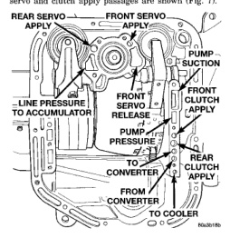

(1) Connect tachometer to engine. Position tachometer so it can be viewed from driver's seat. (2) Drive vehicle to bring transmission fluid up to normal operating temperature. Vehicle can be driven on road or on chassis dynamometer, if available. (3) Check transmission fluid level. Add fluid if necessary. (4) Block front wheels. (5) Fully apply service and parking brakes. (6) Open throttle completely and record maximum engine speed registered on tachometer. It takes 4-10 seconds to reach max rpm. Once max rpm has been achieved, do not hold wide open throttle for more than 4-5 seconds.

CAUTION: Stalling the converter causes a rapid increase in fluid temperature. To avoid fluid overheating, hold the engine at maximum rpm for no more than 5 seconds. If engine exceeds 2500 rpm during the test, release the accelerator pedal immediately; transmission clutch slippage is occurring.

(7) If a second stall test is required, cool down fluid before proceeding. Shift into NEUTRAL and run engine at 1000 rpm for 20-30 seconds to cool fluid.

If the stall speed exceeds 2500 rpm, transmission clutch slippage is indicated.

Low stall speed with a properly tuned engine indicate a torque converter overrunning clutch problem. The condition should be confirmed by road testing. A stall speed 250-350 rpm below normal indicates the converter overrunning clutch is slipping. The vehicle also exhibits poor acceleration but operates normally once highway cruise speeds are reached. Torque converter replacement will be necessary.

If stall speeds are normal (1800-2300 rpm) but abnormal throttle ovening is required for acceleration, or to maintain cruise speed, the converter overrunning clutch is seized. The torque converter will have to be replaced.

A whining noise caused by fluid flow is normal during a stall test. However, loud metallic noises indicate a damaged converter. To confirm that the noise is originating from the converter, operate the vehicle at light throttle in DRIVE and NEUTRAL on a hoist

and listen for noise coming from the converter housing.

Air-pressure testing can be used to check transmission front/rear clutch and band operation. The test can be conducted with the transmission either in the vehicle or on the work bench, as a final check, after overhaul. Air-pressure testing requires that the oil pan and valve body be removed from the transmission. The servo and clutch apply passages are shown (Fig. 7).

*Fig. 7 Air Pressure Test Passages*

Place one or two fingers on the clutch housing and apply air pressure through front clutch apply passage. Piston movement can be felt and a soft thump heard as the clutch applies.

Place one or two fingers on the clutch housing and apply air pressure through rear clutch apply passage. Piston movement can be felt and a soft thump heard as the clutch applies.

Apply air pressure to the front servo apply passage. The servo rod should extend and cause the band to tighten around the drum. Spring pressure should release the servo when air pressure is removed.
