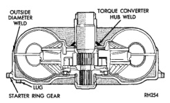
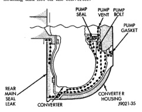

Apply air pressure to the rear servo apply passage. The servo rod should extend and cause the band to tighten around the drum. Spring pressure should release the servo when air pressure is removed.

When diagnosing converter housing fluid leaks, two items must be established before repair. (1) Verify that a leak condition actually exists. (2) Determined the true source of the leak. Some suspected converter housing fluid leaks may not be leaks at all. They may only be the result of residual fluid in the converter housing, or excess fluid spilled during factory fill or fill after repair. Converter housing leaks have several potential sources. Through careful observation, a leak source can be identified before removing the transmission for repair. Pump seal leaks tend to move along the drive hub and onto the rear of the converter. Pump O-ring or pump body leaks follow the same path as a seal leak (Fig. 8). Pump vent or pump attaching bolt leaks are generally deposited on the inside of the converter housing and not on the converter itself (Fig. 8). Pump seal or gasket leaks usually travel down the inside of the converter housing. Front band lever pin plug leaks are generally deposited on the housing and not on the converter.

*Fig. 8*

Possible sources of converter leaks are: (1) Leaks at the weld joint around the outside diameter weld (Fig. 9). (2) Leaks at the converter hub weld (Fig. 9).

(1) Remove converter.

*Fig. 9*

(2) Tighten front band adjusting screw until band is tight around front clutch retainer. This prevents front/rear clutches from coming out when oil pump is removed. (3) Remove oil pump and remove pump seal. Inspect pump housing drainback and vent holes for obstructions. Clear holes with solvent and wire. (4) Inspect pump bushing and converter hub. If bushing is scored, replace it. If converter hub is scored, either polish it with crocus cloth or replace converter. (5) Install new pump seal, O-ring, and gasket. Replace oil pump if cracked, porous or damaged in any way. Be sure to loosen the front band before installing the oil pump, damage to the oil pump seal may occur if the band is still tightened to the front clutch retainer. (6) Loosen kickdown lever pin access plug three turns. Apply Loctite 592, or Permatex No. 2 to plug threads and tighten plug to 17 N.m (150 in. Ibs.) torque. (7) Adjust front band. (8) Lubricate pump seal and converter hub with transmission fluid or petroleum jelly and install converter. (9) Install transmission and converter housing dust shield. (10) Lower vehicle.

The diagnosis charts provide additional reference when diagnosing a transmission fault. The charts provide general information on a variety of transmission, overdrive unit and converter clutch fault conditions. The hydraulic flow charts in the Schematics and Diagrams section of this group, outline fluid flow and hydraulic circuitry. Circuit operation is provided for neutral, third, fourth and reverse gear ranges. Normal working pressures are also supplied for each of the gear ranges.
