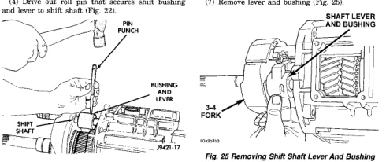
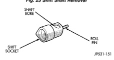
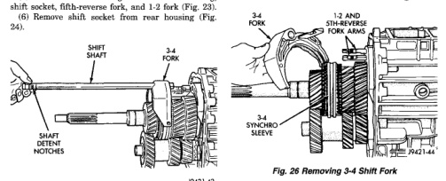

*Fig. 22*

BR

(4) Drive out roll pin that secures shift bushing and lever to shift shaft (Fig. 22).

*Fig. 22 Removing Shift Shaft Lever And Bushing Roll Pin*

(5) Pull shift shaft straight out of rear housing, shift socket, fifth-reverse fork, and 1-2 fork (Fig. 23). (6) Remove shift socket from rear housing (Fig. 24).

*19421-42*

*Fig. 23 Shift Shaft Removal*

*Fig. 24 Shift Socket And Roll Pin*

(7) Remove lever and bushing (Fig. 25).

(8) Remove 3-4 fork. Rotate 3-4 fork around synchro sleeve until fork clears shift arms on 1-2 and fifth-reverse forks. Then remove 3-4 fork (Fig. 26).

*Fig. 26 Removing 3-4 Shift Fork*

*Fig. 23*
