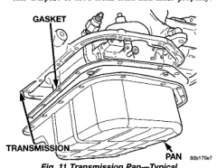
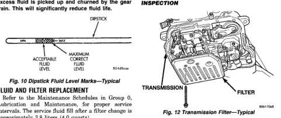

*Fig. 10*

Transmission fluid level should be checked monthly under normal operation. If the vehicle is used for trailer towing or similar heavy load hauling, check fluid level and condition weekly. Fluid level is checked with the engine running at curb idle speed, the transmission in NEUTRAL and the transmission fluid at normal operating temperature.

(1) Transmission fluid must be at normal operating temperature for accurate fluid level check. Drive vehicle if necessary to bring fluid temperature up to normal hot operating temperature of 82℃ (180°F). (2) Position vehicle on level surface. (3) Start and run engine at curb idle speed. (4) Apply parking brakes. (5) Shift transmission momentarily into all gear ranges. Then shift transmission back to Neutral. (6) Clean top of filler tube and dipstick to keep dirt from entering tube. (7) Remove dipstick (Fig. 10) and check fluid level as follows: (a) Correct acceptable level is in crosshatch area. (b) Correct maximum level is to MAX arrow mark. (c) Incorrect level is at or below MIN line. (d) If fluid is low, add only enough Mopar® ATF Plus 3 to restore correct level. Do not overfill.

CAUTION: Do not overfill the transmission. Overfilling may cause leakage out the pump vent which can be mistaken for a pump seal leak. Overfilling will also cause fluid aeration and foaming as the excess fluid is picked up and churned by the gear train. This will significantly reduce fluid life.

Refer to the Maintenance Schedules in Group 0, Lubrication and Maintenance, for proper service intervals. The service fluid fill after a filter change is approximately 3.8 liters (4.0 quarts).

(1) Hoist and support vehicle on safety stands. (2) Place a large diameter shallow drain pan beneath the transmission pan. (3) Remove bolts holding front and sides of pan to transmission (Fig. 11). (4) Loosen bolts holding rear of pan to transmission. (5) Slowly separate front of pan away from transmission allowing the fluid to drain into drain pan. (6) Hold up pan and remove remaining bolt holding pan to transmission. (7) While holding pan level, lower pan away from transmission. (8) Pour remaining fluid in pan into drain pan. (9) Remove screws holding filter to valve body (Fig. 12). (10) Separate filter from valve body and pour fluid in filter into drain pan. (11) Dispose of used trans fluid and filter properly.

*Fig. 11 Transmission Pan-Typical*

*INSPECTION*

*Fig. 12 Transmission Filter-Typical*

Inspect bottom of pan and magnet for excessive amounts of metal. A light coating of clutch or band

*Fig. 12*
