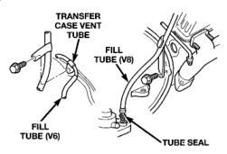
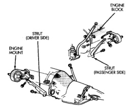

CAUTION: The transmission and torque converter must be removed as an assembly to avoid component damage. The converter drive plate, pump bushing, or oil seal can be damaged if the converter is left attached to the driveplate during removal. Be sure to remove the transmission and converter as an assembly.

(1) Disconnect battery negative cable. (2) Disconnect and lower or remove necessary exhaust components. (3) Remove engine-to-transmission struts, if equipped (Fig. 13).

*Fig. 13*

(4) Disconnect fluid cooler lines at transmission. (5) Remove starter motor. (6) Disconnect and remove the crankshaft position sensor. Retain the sensor attaching bolts. (7) Remove torque converter access cover. (8) If transmission is being removed for overhaul, remove transmission oil pan, drain fluid and reinstall pan. (9) Remove fill tube bracket bolts and pull tube out of transmission. Retain fill tube seal (Fig. 13). On 4 x 4 models, it will also be necessary to remove bolt attaching transfer case vent tube to converter housing (Fig. 14). (10) Mark torque converter and drive plate for assembly alignment. Note that bolt holes in crankshaft flange, drive plate and torque converter all have one offset hole.

*Fig. 14*

80617073

(11) Rotate crankshaft in clockwise direction until converter bolts are accessible. Then remove bolts one at a time. Rotate crankshaft with socket wrench on dampener bolt. (12) Mark propeller shaft and axle vokes for assembly alignment. Then disconnect and remove propeller shaft. On 4 x 4 models, remove both propeller shafts. (13) Disconnect wires from park/neutral position switch and transmission solenoid. (14) Disconnect gearshift rod and torque shaft assembly from transmission. (15) Disconnect throttle valve cable from transmission bracket and throttle valve lever. (16) On 4 x 4 models, disconnect shift rod from transfer case shift lever. (17) Support rear of engine with safety stand or iack. (18) Raise transmission slightly with service jack to relieve load on crossmember and supports. (19) Remove bolts securing rear support and cushion to transmission and crossmember. Raise transmission slightly, slide exhaust hanger arm from bracket (Fig. 15) and remove rear support. (20) Remove bolts attaching crossmember to frame and remove crossmember. (21) On 4 x 4 models, remove transfer case with transmission jack or aid of helper. (22) Remove all converter housing bolts. (23) Carefully work transmission and torque converter assembly rearward off engine block dowels. (24) Lower transmission and remove assembly from under the vehicle. (25) To remove torque converter, remove C-clamp from edge of bell housing and carefully slide torque converter out of the transmission.
