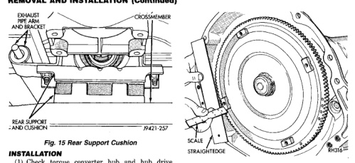

# TRANSMISSION AND TRANSFER CASE 21-119

## REMOVAL AND INSTALLATION (Continued)

*Fig. 16 Rear Support Cushion]*
- EXHAUST PIPE ARM AND BRACKET
- CROSSMEMBER
- REAR SUPPORT AND CUSHION

### INSTALLATION

(1) Check torque converter hub and hub drive notches for sharp edges, burrs, scratches, or nicks. Polish the hub and notches with 320/400 grit paper and crocus cloth if necessary. The hub must be smooth to avoid damaging pump seal at installation.

(2) Lubricate converter drive hub and oil pump seal lip with transmission fluid.

(3) Lubricate converter pilot hub with transmission fluid.

(4) Align and install converter in oil pump.

(5) Carefully insert converter in oil pump. Then rotate converter back and forth until fully seated in pump gears.

(6) Check converter seating with steel scale and straightedge (Fig. 16). Surface of converter lugs should be 1/2 in. to rear of straightedge when converter is fully seated.

[Figure: Fig. 16 Typical Method of Checking Converter Seating]
- SCALE
- STRAIGHTEDGE
- BUSHING

(7) Temporarily secure converter with C-clamp.

(8) Position transmission on jack and secure it with chains.

(9) Check condition of converter driveplate. Replace the plate if cracked, distorted or damaged. Also be sure transmission dowel pins are seated in engine block and protrude far enough to hold transmission in alignment.

(10) Raise transmission and align converter with drive plate and converter housing with engine block.

(11) Move transmission forward. Then raise, lower or tilt transmission to align converter housing with engine block dowels.

(12) Rotate converter so alignment marks scribed on converter are aligned with mark on driveplate.

(13) Carefully work transmission forward and over engine block dowels until converter hub is seated in crankshaft.

(14) Install bolts attaching converter housing to engine.

(15) Install rear support. Then lower transmission onto crossmember and install bolts attaching transmission mount to crossmember.

(16) Remove engine support fixture.

(17) Install crankshaft position sensor.

(18) Install new plastic retainer grommet on any shift linkage rod or lever that was disconnected. Grommets should not be reused. Use pry tool to remove rod from grommet and cut away old grommet. Use pliers to snap new grommet into lever and to snap rod into grommet at assembly.

(19) Connect gearshift and throttle cable to transmission.

(20) Connect wires to park/neutral position switch, transmission solenoid(s) and oxygen sensor. Be sure transmission harnesses are properly routed.

**CAUTION:** It is essential that correct length bolts be used to attach the converter to the driveplate. Bolts that are too long will damage the clutch surface inside the converter.

(21) Install torque converter-to-driveplate bolts. On models with 10.75 in. converter, tighten bolts to 31 N·m (270 in. lbs.). On models with 12.2 in. converter, tighten bolts to 47 N·m (35 ft. lbs.).

(22) Install converter housing access cover.

(23) Install starter motor and cooler line bracket.

(24) Connect cooler lines to transmission.

(25) Install transmission fill tube. Install new seal on tube before installation.

(26) Install exhaust components.

(27) Align and connect propeller shaft.

(28) Adjust gearshift linkage and throttle valve cable if necessary.