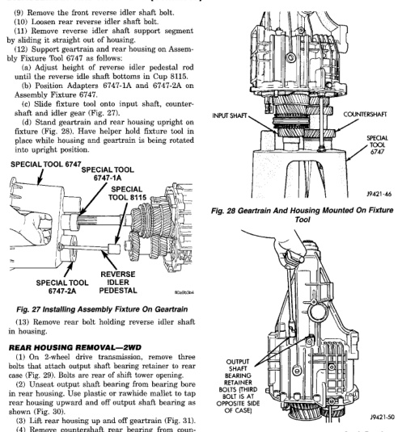

*Fig. 27 Installing Assembly Fixture On Geartrain*

(1) On 2-wheel drive transmission, remove three bolts that attach output shaft bearing retainer to rear case (Fig. 29). Bolts are rear of shift tower opening. (2) Unseat output shaft bearing from bearing bore in rear housing. Use plastic or rawhide mallet to tap rear housing upward and off output shaft bearing as shown (Fig. 30). (3) Lift rear housing up and off geartrain (Fig. 31). (4) Remove countershaft rear bearing from countershaft (Fig. 32). (5) Examine condition of bearing bore and idler shaft notch in rear housing. Replace housing if any of these components are damaged.

(1) Locate dimples in face of rear seal (Fig. 33). Use a suitable slide hammer mounted screw to remove seal by inserting screw into seal at dimple locations (Fig. 34).

*Fig. 28 Geartrain And Housing Mounted On Fixture*

*Fig. 29 Removing/Installing Output Shaft Bearing Retainer Bolts-2WD*
