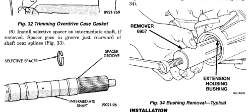
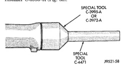
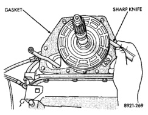

*Fig. 2*

(7) Install thrust bearing in overdrive unit sliding hub. Use petroleum jelly to hold bearing in position.

CAUTION: Be sure the shoulder on the inside diameter of the bearing is facing forward.

(8) Verify that splines in overdrive planetary gear and overrunning clutch hub are aligned with Alignment Tool 6227-2. Overdrive unit cannot be installed if splines are not aligned. If splines have rotated out of alignment, unit will have to be disassembled to realign splines. (9) Carefully slide Alignment Tool 6227-2 out of overdrive planetary gear and overrunning clutch splines. (10) Raise overdrive unit and carefully slide it straight onto intermediate shaft. Insert park rod into park lock reaction plug at same time. Avoid tilting overdrive during installation as this could cause planetary gear and overrunning clutch splines to rotate out of alignment. If this occurs, it will be necessary to remove and disassemble overdrive unit to realign splines.

(11) Work overdrive unit forward on intermediate shaft until seated against transmission case. (12) Install bolts attaching overdrive unit to transmission unit. Tighten bolts in diagonal pattern to 34 N.m (25 ft-lbs). (13) Align and install propeller shaft(s).

(1) Remove overdrive housing voke seal. (2) Insert Remover 6957 into overdrive housing. Tighten tool to bushing and remove bushing (Fig.

(1) Align bushing oil hole with oil slot in overdrive housing (2) Tap bushing into place with Installer 6951 and Handle C-4171. (3) Install new oil seal in housing using Seal Installer C-3995-A (Fig. 35).

*Fig. 3*

(1) Remove overdrive unit from the vehicle. (2) Remove overdrive geartrain from housing.

*Fig. 35*
